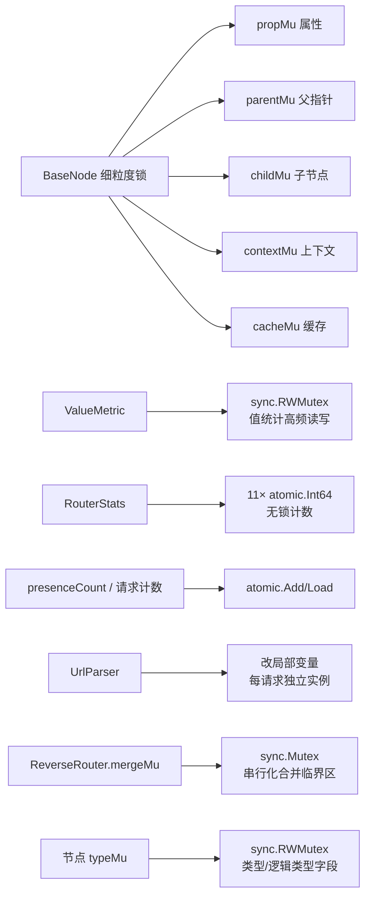
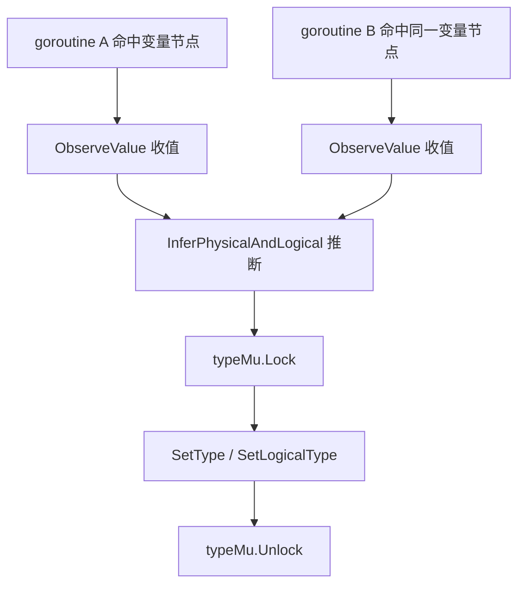
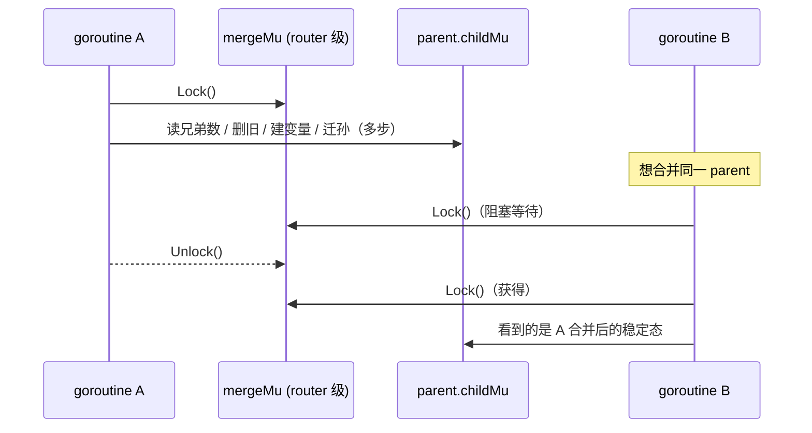

# 并发设计

> 逆向路由器要能被多协程并发喂数据，所以并发安全是硬要求。

## 各层的并发保护

源码：节点多锁 [`BaseNode` 锁字段 (base_node.go:44-52)](https://github.com/cyberspacesec/reverse-router-tree-skills/blob/main/pkg/node/base_node.go#L44-L52) · 值统计锁 [`ValueMetric` (value.go:18-32)](https://github.com/cyberspacesec/reverse-router-tree-skills/blob/main/pkg/value/value.go#L18-L32) · 统计原子 [`RouterStats` / `StatsSnapshot` (logger.go:195-238)](https://github.com/cyberspacesec/reverse-router-tree-skills/blob/main/pkg/router/logger.go#L195-L238) · 合并临界区 [`mergeMu` (reverse_router.go:68-74)](https://github.com/cyberspacesec/reverse-router-tree-skills/blob/main/pkg/router/reverse_router.go#L68-L74) · 节点类型字段 [`typeMu` (request_path_variable_node.go:24-29)](https://github.com/cyberspacesec/reverse-router-tree-skills/blob/main/pkg/node/request_path_variable_node.go#L24-L29)



```
层              并发保护机制
─────────────────────────────────────────────────────
BaseNode        细粒度锁：propMu / parentMu / childMu / contextMu
                （不同属性用不同锁，减少争用）
BaseNodeContext 读写锁 sync.RWMutex
ValueMetric     读写锁 sync.RWMutex（值统计高频读写）
请求计数        atomic 操作
UrlParser       改为局部变量（避免竞态）
RouterStats     所有计数器 atomic.Int64（无锁，线程安全）
节点类型字段    typeMu sync.RWMutex（变量/参数节点的物理+逻辑类型）
合并临界区      mergeMu sync.Mutex（router 级，串行化兄弟合并）
```

## 为什么 BaseNode 用多把锁

一棵节点树，子节点列表、父指针、属性、上下文是不同的访问热点。如果用一把大锁，并发加点会互相阻塞：

```
单锁方案（差）:                    多锁方案（当前）:
  node.Lock()                       node.childMu.Lock()   ← 加子节点
   ├─ 改属性                         node.propMu.Lock()    ← 改属性（独立锁，不互斥）
   ├─ 加子节点                       可并行进行
   └─ 改上下文
  node.Unlock()
```

细粒度锁让“加子节点”和“改属性”能并发，提升吞吐。

## RouterStats：无锁统计

11 项统计指标全部用 `atomic.Int64`，读不阻塞写、写不阻塞读：

```go
type RouterStats struct {
	requestsProcessed    atomic.Int64
	pathVariablesIdentified atomic.Int64
	patternDetections    atomic.Int64
	// ... 共 11 项
}

// 任意协程并发调用都安全
stats.IncRequestsProcessed()
stats.IncPathVariablesIdentified()
snapshot := stats.Snapshot()   // 返回值类型快照，可 JSON 序列化
stats.Reset()                  // 清零
```

## ValueMetric：值统计并发安全

每个参数/变量节点记录“哪些值出现了几次”，这是高频写操作（每个请求都观察值），用 `sync.RWMutex`：

```go
ValueMetric
 └─ valueMap: map[string]int   // 值 → 出现次数
    RLock() 读 / Lock() 写（并发安全）
```

## 节点类型字段：typeMu

路径变量节点（`RequestPathVariableNode`）和参数节点（`RequestParamNode`）的物理类型、逻辑类型、必需性等字段，在多 goroutine 命中**同一已存在节点**时会被并发回填（`findOrCreatePathNode` / `findOrCreateParamNode` 命中后调 `InferPhysicalAndLogical` 写回）。这些字段用各自的 `typeMu sync.RWMutex` 保护：



`presenceCount` 用 `atomic.Int64` 单独处理（高频自增，不适合互斥锁）。

## 合并临界区：mergeMu

兄弟节点合并是 router 里最复杂的并发点。一次合并要“读兄弟数 → 决策模式 → 删旧节点 → 建变量节点 → 迁移孙节点”多步，`BaseNode.childMu` 只保护单次子节点操作，无法保证整体原子。两个 goroutine 并发合并同一 parent 会读到中间态，导致 double-move 或丢失孙节点。



所以用 **router 级 `mergeMu sync.Mutex`** 串行化整个 `checkAndMergeSiblings` 临界区。合并是低频操作（每 N 个请求触发一次，`SiblingMergeThreshold=3`），router 级串行化的吞吐代价可接受。

锁顺序单向：`mergeMu → childMu`（合并时先拿 mergeMu，内部再操作子节点拿 childMu）。`findOrCreatePathNode` 在拿到 mergeMu 前已释放 childMu，不存在逆向获取，**无死锁风险**。

## 已修复的并发 bug

历史上踩过的坑（都已修复）：

1. **`VisitChildren` 并发数据竞态** — 遍历时被并发修改，加锁保护
2. **`ValueMetric` 缺并发安全保护** — 补 `sync.RWMutex`
3. **`ReverseRouter.urlParser` 并发竞态** — 改为局部变量，每个请求独立实例
4. **节点类型字段并发写竞态** — `findOrCreatePathNode`/`findOrCreateParamNode` 命中已存在节点后并发回填类型，给变量/参数节点的 `valueType`/`logicalType`/`required` 等字段补 `typeMu sync.RWMutex`
5. **兄弟合并临界区非原子** — `checkAndMergeSiblings` 多步操作补 router 级 `mergeMu sync.Mutex` 串行化，消除 double-move/丢节点

测试用 `-race` 竞态检测器覆盖：8 goroutine × 300 请求并发命中同一变量+参数节点（`TestReverseHttpRequest_ConcurrentSafe`）、50 goroutine 并发数字 ID 触发合并（`TestReverseRouter_ConcurrentRequests`）。**所有测试在 `-race` 下通过**。

## 下一步

- 统计指标有哪些 → [日志与统计](/features/observability)
- 推断过程涉及哪些并发结构 → [类型推断体系](./type-inference)
