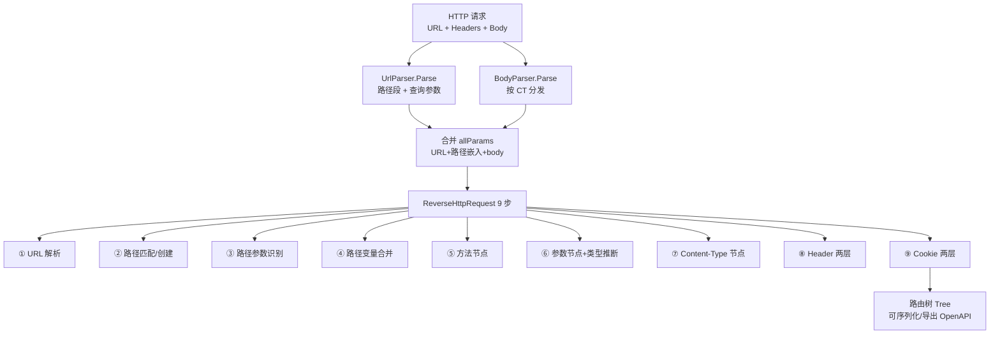

# 分层与数据流

源码：请求解析 [`UrlParser.Parse` (url_parser.go:16-60)](https://github.com/cyberspacesec/reverse-router-tree-skills/blob/main/pkg/request/url_parser.go#L16-L60) · [`BodyParser.Parse` (body_parser.go:32-67)](https://github.com/cyberspacesec/reverse-router-tree-skills/blob/main/pkg/request/body_parser.go#L32-L67) · 9 步主流程 [`ReverseHttpRequest` (reverse_router.go:143-256)](https://github.com/cyberspacesec/reverse-router-tree-skills/blob/main/pkg/router/reverse_router.go#L143-L256)

## 一个请求的完整数据流



```
HTTP 请求 (原始 URL + Headers + Body)
    │
    ▼
┌──────────────────────────────────────────────────────────┐
│ UrlParser.Parse()                                        │
│   ├─▶ []*HttpRequestPath   路径段：URL 解码、过滤 ./..    │
│   └─▶ []*HttpParam         查询参数：参数名小写、多值展开  │
└──────────────────────────────────────────────────────────┘
    │
    ▼
┌──────────────────────────────────────────────────────────┐
│ BodyParser.Parse(contentType, body)   ← 按 Content-Type  │
│   └─▶ []*HttpParam         表单/JSON/multipart，参数小写   │
└──────────────────────────────────────────────────────────┘
    │
    ▼
合并：URL 查询参数 + 路径嵌入参数 + body 参数  =  allParams
    │
    ▼
┌──────────────────────────────────────────────────────────┐
│ ReverseRouter.ReverseHttpRequest()  —— 9 步处理           │
│                                                          │
│  ① URL 解析（上面已做）                                    │
│  ② 路径匹配/创建（尾部斜杠、URL 解码）                     │
│  ③ 路径参数识别（key=value 格式）                          │
│  ④ 路径变量识别合并（选择性合并，固定路径保留）            │
│  ⑤ HTTP 方法节点                                         │
│  ⑥ 查询参数+body 参数节点（合并、大小写不敏感、类型推断）  │
│  ⑦ Content-Type 节点                                     │
│  ⑧ Header 路由节点（两层：名称→值）                       │
│  ⑨ Cookie 路由节点（两层：名称→值）                       │
└──────────────────────────────────────────────────────────┘
    │
    ▼
路由树 (Tree)  ── 可序列化 / 导出 OpenAPI
```

## 数据形态的变化

同一份信息在不同层形态不同：

```
原始 URL:  /api/users/123?page=1&tag=go&tag=web

 ┌─ UrlParser ─────────────────────────────────────┐
 │  paths:  ["api", "users", "123"]                 │   路径段（有序、已解码）
 │  params: [{name:"page", value:"1"},              │   参数名已小写
 │           {name:"tag",  value:"go"},             │   多值已展开成多条
 │           {name:"tag",  value:"web"}]            │
 └─────────────────────────────────────────────────┘
                          │
                          ▼  进入树后
 ┌─ Tree ───────────────────────────────────────────┐
 │  api → users → {users_id}(=123)                  │   123 被合并成变量
 │             → GET → page[Param]                  │   page 节点
 │                   → tag[Param, multiValue]       │   tag 多值合并成一节点
 └─────────────────────────────────────────────────┘
```

## 各层职责边界

| 层 | 输入 | 输出 | 关键产出 |
|------|------|------|----------|
| **request** | 原始 URL/Headers/Body | `[]*HttpRequestPath` / `[]*HttpParam` | 规范化后的路径段和参数 |
| **router** | `HttpRequest` | 修改 `Tree` | 9 步把请求逆向进树 |
| **node** | 节点操作调用 | 节点状态 | 树形结构 + 上下文 + 类型标注 |
| **inference** | 参数/路径变量值 | 物理类型 + 逻辑类型 | 两层推断结果 |
| **value** | 值观察 | 类型 + 值统计 | `ValueMetric` 记录值分布 |
| **tree** | 节点树 | 文本/JSON/统计 | 序列化与可视化 |
| **exporter** | `Tree` | OpenAPI 3.0.3 JSON | 标准 API 文档 |

## 下一步

- 树长什么样 → [路由树结构](./tree-structure)
- 9 步流程逐步详解 → [9 步逆向流程](/features/reverse-flow)
