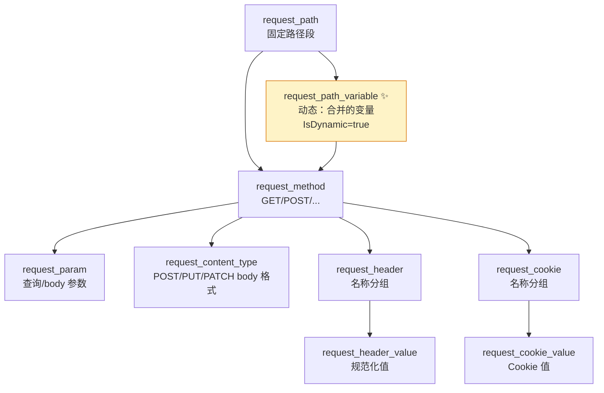

# 节点类型体系

所有节点都实现 `Node` 接口（基类 [`BaseNode` (base_node.go:64-260)](https://github.com/cyberspacesec/reverse-router-tree-skills/blob/main/pkg/node/base_node.go#L64-L260)），靠 `GetType()` 区分种类。

## 节点类型一览表

| 节点类型 | GetType() | Key 含义 | Value 含义 | 动态? | 源码 |
|----------|-----------|----------|------------|-------|------|
| `BaseNode` | 自定义 | 自定义 | 自定义 | 否 | [base_node.go](https://github.com/cyberspacesec/reverse-router-tree-skills/blob/main/pkg/node/base_node.go) |
| `RequestPathNode` | `request_path` | 路径段名 | 空 | 否 | [request_path_node.go](https://github.com/cyberspacesec/reverse-router-tree-skills/blob/main/pkg/node/request_path_node.go) |
| `RequestPathVariableNode` | `request_path_variable` | 位置标识 | 空 | **是** | [request_path_variable_node.go](https://github.com/cyberspacesec/reverse-router-tree-skills/blob/main/pkg/node/request_path_variable_node.go) |
| `RequestMethodNode` | `request_method` | HTTP 方法 | 空 | 否 | [request_method_node.go](https://github.com/cyberspacesec/reverse-router-tree-skills/blob/main/pkg/node/request_method_node.go) |
| `RequestContentTypeNode` | `request_content_type` | Content-Type | 空 | 否 | [request_content_type_node.go](https://github.com/cyberspacesec/reverse-router-tree-skills/blob/main/pkg/node/request_content_type_node.go) |
| `RequestParamNode` | `request_param` | 参数名(小写) | 默认值 | 否 | [request_param_node.go](https://github.com/cyberspacesec/reverse-router-tree-skills/blob/main/pkg/node/request_param_node.go) |
| `RequestHeaderNode` | `request_header` | Header 名称 | Header 名称 | 否 | [request_header_node.go](https://github.com/cyberspacesec/reverse-router-tree-skills/blob/main/pkg/node/request_header_node.go) |
| `RequestHeaderValueNode` | `request_header_value` | 规范化值 | Header 名称 | 否 | [request_header_node.go](https://github.com/cyberspacesec/reverse-router-tree-skills/blob/main/pkg/node/request_header_node.go) |
| `RequestCookieNode` | `request_cookie` | Cookie 名称 | Cookie 名称 | 否 | [request_cookie_node.go](https://github.com/cyberspacesec/reverse-router-tree-skills/blob/main/pkg/node/request_cookie_node.go) |
| `RequestCookieValueNode` | `request_cookie_value` | Cookie 值 | Cookie 名称 | 否 | [request_cookie_node.go](https://github.com/cyberspacesec/reverse-router-tree-skills/blob/main/pkg/node/request_cookie_node.go) |

## 在树里的位置



```
request_path                  ← 固定路径段
request_path_variable ✨      ← 动态：合并出来的变量（唯一 IsDynamic=true）
  request_method
    request_param             ← 查询参数 / body 参数
    request_content_type      ← POST/PUT/PATCH 的请求体格式
    request_header
      request_header_value
    request_cookie
      request_cookie_value
```

## 关键节点详解

### RequestPathNode `request_path`

最普通的路径段节点，如 `/api/users` 中的 `api`、`users`。Key 就是路径段名。

### RequestPathVariableNode `request_path_variable`

源码：[`NewRequestPathVariableNode` (request_path_variable_node.go:38-67)](https://github.com/cyberspacesec/reverse-router-tree-skills/blob/main/pkg/node/request_path_variable_node.go#L38-L67) · [`IsMatch` (request_path_variable_node.go:86-110)](https://github.com/cyberspacesec/reverse-router-tree-skills/blob/main/pkg/node/request_path_variable_node.go#L86-L110) · [`IsDynamic` (request_path_variable_node.go:257)](https://github.com/cyberspacesec/reverse-router-tree-skills/blob/main/pkg/node/request_path_variable_node.go#L257)

**核心动态节点**——由多个相似兄弟路径合并而成。

```
合并前:                          合并后:
users                            users
 ├─ 101 [Path]                    ├─ list [Path]          ← 固定，保留
 ├─ 102 [Path]                    ├─ create [Path]        ← 固定，保留
 ├─ 103 [Path]                    └─ {users_id} [Var]     ← 合并的变量
 ├─ list [Path]                       type: integer
 └─ create [Path]                     pattern: [0-9]+
```

`IsDynamic=true`，`IsMatch()` 行为：
- **有模式时**：严格用正则匹配
- **无模式时**：启发式（数字、UUID 等可变特征）

详见 [路径变量识别](/features/path-variable)。

### RequestParamNode `request_param`

源码：[`NewRequestParamNode` (request_param_node.go:37-58)](https://github.com/cyberspacesec/reverse-router-tree-skills/blob/main/pkg/node/request_param_node.go#L37-L58) · [`IsMatch` (request_param_node.go:66-89)](https://github.com/cyberspacesec/reverse-router-tree-skills/blob/main/pkg/node/request_param_node.go#L66-L89) · `IncrementPresenceCount` 在 [`request_param_node.go:140`](https://github.com/cyberspacesec/reverse-router-tree-skills/blob/main/pkg/node/request_param_node.go#L140)

查询参数 / body 参数节点。承载的能力最多：

```
page* [Param]
 └─ physical_type: integer
    logical_type: string
    required: true              ← InferRequiredParams 推断
    presence_count: 10          ← 出现次数
    default_value: "1"
    multi_value: false
```

- **大小写不敏感**：`Page`/`page`/`PAGE` 统一存为 `page`
- **多值**：`?tag=go&tag=web` 合并到同一节点，`multi_value=true`
- **类型推断**：创建时和观察新值时自动推断物理+逻辑类型
- **必需性**：`presenceCount` 累加，`InferRequired` 判定

详见 [查询参数处理](/features/query-params)。

### RequestMethodNode `request_method`

HTTP 方法节点，Key 是 `GET`/`POST`/`PUT`/`DELETE` 等。是路径节点到参数节点的**分界层**——同一个路径可以有多个方法。

### RequestContentTypeNode `request_content_type`

仅 POST/PUT/PATCH 创建。同一个方法下，JSON 和表单进不同 CT 子节点：

```
POST
 ├─ application/json [ContentType]    ← JSON body
 └─ application/x-www-form-urlencoded [ContentType]  ← 表单 body
```

### Header / Cookie 两层节点

```
Accept [request_header]          ← 名称分组节点
 ├─ application/json [request_header_value]
 └─ text/html [request_header_value]

lang [request_cookie]            ← 名称分组节点
 ├─ zh-CN [request_cookie_value]
 └─ en-US [request_cookie_value]
```

第一层节点（`request_header`/`request_cookie`）的 Key 是名称；第二层值节点的 Key 是规范化后的值，Value 字段回填名称（便于回溯分组）。

## NodeContext 节点上下文

每个节点附带一个 `NodeContext`（键值存储），用于存额外信息：

- 路径变量：`inferred_type`（物理类型）、`logical_type`、模式正则
- 参数节点：`required`、`physical_type`、`logical_type`、`presence_count`、`default_value`、`multi_value`
- Header/Cookie 值节点：`ValueMetric`（值观察统计）

## 下一步

- 类型怎么推断出来的 → [类型推断体系](./type-inference)
- 节点并发安全怎么保证 → [并发设计](./concurrency)
