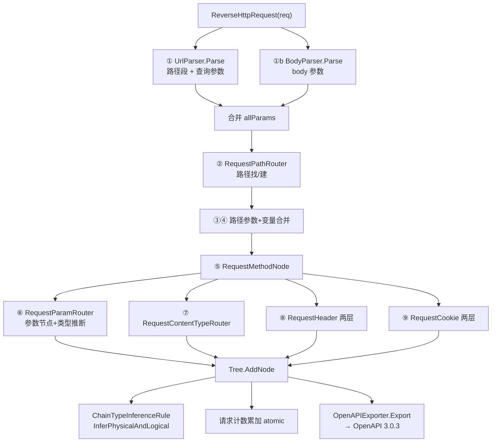

# 整体架构

## 一张图看全貌

```
┌─────────────────────────────────────────────────────────────┐
│                     ReverseRouter                           │
│   核心入口：ReverseHttpRequest() / IsNeedRequest()          │
│   把 HTTP 请求逆向工程进路由树（9 步）                       │
└──────────────────────────┬──────────────────────────────────┘
                           │
        ┌──────────────────┼──────────────────┐
        ▼                  ▼                  ▼
┌──────────────┐  ┌──────────────┐  ┌──────────────────┐
│RequestPath   │  │RequestParam  │  │RequestContent    │
│Router        │  │Router        │  │TypeRouter        │
│按路径找/建   │  │按参数找/建   │  │按Content-Type找  │
└──────┬───────┘  └──────┬───────┘  └────────┬─────────┘
       └─────────────────┼───────────────────┘
                         ▼
                ┌─────────────────┐
                │     Tree        │  路由树容器
                │  Root → Node    │
                └────────┬────────┘
                         ▼
                ┌─────────────────┐
                │     Node        │  树形节点
                └────────┬────────┘
                         │
     ┌───────────────────┼───────────────────┐
     ▼                   ▼                   ▼
┌───────────┐    ┌──────────────┐    ┌──────────────┐
│PathNode   │    │MethodNode    │    │ParamNode     │
│/api/users │    │GET/POST/...  │    │page&size     │
└─────┬─────┘    └──────────────┘    └──────────────┘
      ▼
┌──────────────┐ ┌──────────────┐ ┌──────────────────┐
│PathVariable  │ │PathVariable  │ │ContentTypeNode   │
│Node {id}     │ │Node {name}   │ │application/json  │
│类型推断       │ │类型推断       │ └──────────────────┘
└──────────────┘ └──────────────┘

┌─────────────────┐   ┌─────────────────┐
│HeaderNode       │   │CookieNode       │
│Accept           │   │lang             │  ← 名称分组节点
│ ├─ application/ │   │ ├─ zh-CN        │
│ │  json         │   │ └─ en-US        │  ← 值子节点
│ └─ text/html    │   │                 │
└─────────────────┘   └─────────────────┘

┌─────────────────────────────────────────────────────────────┐
│                    Exporter 导出层                          │
│   OpenAPIExporter.Export(tree) → OpenAPI 3.0.3              │
│   路径变量还原 {var} · 四类参数分类 · 请求体 schema · 稳定排序 │
└─────────────────────────────────────────────────────────────┘
```

## 分层职责

| 层 | 包 | 职责 | 源码 |
|------|------|------|------|
| **路由层** | `pkg/router` | 核心入口 `ReverseRouter`，9 步逆向流程，合并策略，日志统计 | [`reverse_router.go`](https://github.com/cyberspacesec/reverse-router-tree-skills/blob/main/pkg/router/reverse_router.go) · [`logger.go`](https://github.com/cyberspacesec/reverse-router-tree-skills/blob/main/pkg/router/logger.go) |
| **请求层** | `pkg/request` | `UrlParser`（URL 解码/参数小写化）、`BodyParser`（表单/JSON/multipart）、`Headers`/`Cookies` | [`url_parser.go`](https://github.com/cyberspacesec/reverse-router-tree-skills/blob/main/pkg/request/url_parser.go) · [`body_parser.go`](https://github.com/cyberspacesec/reverse-router-tree-skills/blob/main/pkg/request/body_parser.go) · [`http_headers.go`](https://github.com/cyberspacesec/reverse-router-tree-skills/blob/main/pkg/request/http_headers.go) |
| **树层** | `pkg/tree` | 路由树容器，节点增删查、可视化、JSON 序列化、统计 | [`tree.go`](https://github.com/cyberspacesec/reverse-router-tree-skills/blob/main/pkg/tree/tree.go) |
| **节点层** | `pkg/node` | 各类节点（Path/Method/Param/PathVariable/ContentType/Header/Cookie），节点上下文 | [`base_node.go`](https://github.com/cyberspacesec/reverse-router-tree-skills/blob/main/pkg/node/base_node.go) |
| **推断层** | `pkg/inference` | 物理类型 + 逻辑类型 + 链式推断规则 | [`physical_type_inference_rule.go`](https://github.com/cyberspacesec/reverse-router-tree-skills/blob/main/pkg/inference/physical_type_inference_rule.go) · [`logical_type_inference_rule.go`](https://github.com/cyberspacesec/reverse-router-tree-skills/blob/main/pkg/inference/logical_type_inference_rule.go) · [`chain_type_inference_rule.go`](https://github.com/cyberspacesec/reverse-router-tree-skills/blob/main/pkg/inference/chain_type_inference_rule.go) |
| **值层** | `pkg/value` | 类型体系、`ValueMetric` 值统计（并发安全） | [`value.go`](https://github.com/cyberspacesec/reverse-router-tree-skills/blob/main/pkg/value/value.go) · [`type.go`](https://github.com/cyberspacesec/reverse-router-tree-skills/blob/main/pkg/value/type.go) |
| **导出层** | `pkg/exporter` | OpenAPI 3.0.3 导出 | [`openapi.go`](https://github.com/cyberspacesec/reverse-router-tree-skills/blob/main/pkg/exporter/openapi.go) |

## 调用关系

源码：核心入口 [`ReverseHttpRequest` (reverse_router.go:143-256)](https://github.com/cyberspacesec/reverse-router-tree-skills/blob/main/pkg/router/reverse_router.go#L143-L256) · [`IsNeedRequest` (reverse_router.go:890-990)](https://github.com/cyberspacesec/reverse-router-tree-skills/blob/main/pkg/router/reverse_router.go#L890-L990)



## 包依赖方向

依赖始终从“上层”流向“下层”，`value` 和 `inference` 是最底层，`router` 是最上层，`exporter` 只依赖 `tree`/`node`/`value`（不依赖 `router`，可独立使用）：

```
router
  ├── request
  ├── tree
  │     └── node
  │           └── value
  ├── inference
  │     └── value
  └── value

exporter  ← 独立，只依赖 tree/node/value
```

## 下一步

- 数据怎么一层层流的 → [分层与数据流](./data-flow)
- 树长什么样 → [路由树结构](./tree-structure)
- 有哪些节点类型 → [节点类型体系](./node-types)
