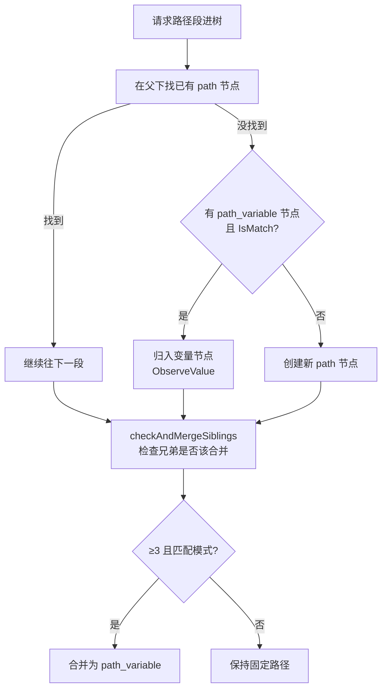

# 路由树结构

> 路由树是整个项目的核心数据结构——所有逆向出的信息最终都落在这棵树上。

## 一棵真实的路由树

把下面这些请求喂进去：

```
GET  /api/users
GET  /api/users/123
GET  /api/users/456
POST /api/users  (Content-Type: application/json)
GET  /api/users?page=1&size=10
GET  /api/data   (Accept: application/json)
GET  /api/data   (Accept: text/html)
GET  /api/home   (Cookie: lang=zh-CN)
GET  /api/home   (Cookie: lang=en-US)
```

长出来的树：

```
root
└── api [Path]
    ├── users [Path]
    │   ├── {users_id} [Var, integer]     ← 路径变量
    │   │   └── GET [Method]
    │   ├── GET [Method]
    │   │   ├── page [Param]
    │   │   └── size [Param]
    │   └── POST [Method]
    │       └── application/json [ContentType]
    ├── data [Path]
    │   └── GET [Method]
    │       └── Accept [Header]
    │           ├── Accept: application/json [HeaderValue]
    │           └── Accept: text/html [HeaderValue]
    └── home [Path]
        └── GET [Method]
            └── lang [Cookie]
                ├── lang=zh-CN [CookieValue]
                └── lang=en-US [CookieValue]
```

## 树的构造规则

源码：节点查找/创建在 [`findOrCreatePathNode` (reverse_router.go:262-294)](https://github.com/cyberspacesec/reverse-router-tree-skills/blob/main/pkg/router/reverse_router.go#L262-L294) · 合并检查 [`checkAndMergeSiblings` (reverse_router.go:296-321)](https://github.com/cyberspacesec/reverse-router-tree-skills/blob/main/pkg/router/reverse_router.go#L296-L321) · 树容器 [`Tree` (tree.go:18-95)](https://github.com/cyberspacesec/reverse-router-tree-skills/blob/main/pkg/tree/tree.go#L18-L95)



### 节点嵌套层级

```
root
 └─ <path段>      [request_path]        层级 1：路径
     └─ <path段>  [request_path]        层级 2：路径
         └─ {var} [request_path_variable] 层级 3：路径变量（动态）
             └─ <METHOD> [request_method]      层级 4：HTTP 方法
                 ├─ <param> [request_param]    层级 5：查询/body 参数
                 ├─ <CT> [request_content_type]层级 5：Content-Type
                 ├─ <Header名> [request_header]
                 │    └─ <Header值> [request_header_value]
                 └─ <Cookie名> [request_cookie]
                      └─ <Cookie值> [request_cookie_value]
```

**路径段在方法节点之上，参数/CT/Header/Cookie 在方法节点之下**——因为同一个路径可以有多种方法，每种方法有自己的参数和请求体格式。

## Header / Cookie 的两层结构

为什么要两层？看 Header 的例子：

```
单层（不好）:                    两层（当前方案）:
GET                              GET
 ├─ Accept:json                  └─ Accept [header]
 └─ Accept:html                       ├─ application/json
                                       └─ text/html
```

| 设计 | 单层 | 两层 |
|------|------|------|
| 节点 key | `Accept:json`（混了名称和值） | 名称节点 + 值子节点 |
| 查找 | 必须知道完整值 | 先按名称找分组，再按值找 |
| 变量合并 | 难，key 混杂 | 容易，值是兄弟节点 |
| 统计 | 只能数总数 | 可分别数“名称数”和“值数” |

两层结构让“同一 Header 的不同值”成为兄弟节点，未来可像路径变量一样合并（比如 `Authorization` 的多个 token 合并成一个变量）。

## 节点类型一览

每种节点在树里承担不同角色，详见 [节点类型体系](./node-types)。

## 序列化

源码：[`Tree.ToJSON` (tree.go:227-231)](https://github.com/cyberspacesec/reverse-router-tree-skills/blob/main/pkg/tree/tree.go#L227-L231) · [`Tree.FromJSON` (tree.go:277-382)](https://github.com/cyberspacesec/reverse-router-tree-skills/blob/main/pkg/tree/tree.go#L277-L382) 完整保留类型信息，往返一致，可用于持久化。详见 [路由树序列化](/features/serialization)。

## 下一步

- 各种节点的字段含义 → [节点类型体系](./node-types)
- 这棵树怎么一步步长出来的 → [9 步逆向流程](/features/reverse-flow)
