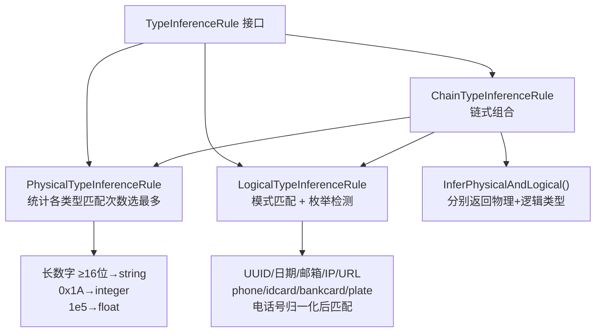
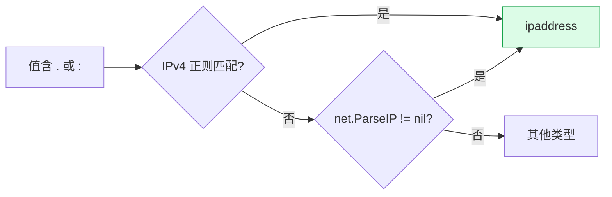

# 类型推断体系

> 参数值和路径变量的值，到底是数字、字符串、还是手机号？这是两层推断要回答的问题。

## 两层类型

```
Value（一个值）
 │
 ├── PhysicalType 物理类型      ── 它在计算机里是什么基本类型
 │     string / integer / float
 │     boolean / array / object / null
 │
 └── LogicalType 逻辑类型       ── 它在业务上是什么语义
        基本类型：date / time / datetime / email / url / uuid
                  json / xml / ipaddress
        数值扩展：decimal / currency / percentage
        特殊类型：enum / binary / reference
        中国特有：phone / idcard / bankcard / plate
```

**物理类型回答“能不能算术”，逻辑类型回答“业务是什么”。** 二者协同：

| 值 | 物理类型 | 逻辑类型 |
|------|----------|----------|
| `13812345678` | integer | **phone** |
| `110101199001011234` | string（18位降级） | **idcard** |
| `a@b.com` | string | **email** |
| `123` | integer | string（无特殊语义） |

## 三条推断规则

源码：接口与规则实现 [`pkg/inference/`](https://github.com/cyberspacesec/reverse-router-tree-skills/blob/main/pkg/inference/)



```
TypeInferenceRule（接口）
 │
 ├── PhysicalTypeInferenceRule    统计各类型匹配次数，选最多的
 │     ├─ 长数字串降级：≥16位纯数字 → string（避 int64 溢出，标识符语义）
 │     ├─ 十六进制：0x1A → integer
 │     └─ 科学计数法：1e5 → float
 │
 ├── LogicalTypeInferenceRule     模式匹配 + 枚举检测
 │     ├─ UUID/日期/邮箱/IP/URL/JSON/XML 模式
 │     ├─ 中国特有：phone/idcard/bankcard/plate
 │     └─ 电话号码归一化：去除空格/横线/括号后再匹配
 │
 └── ChainTypeInferenceRule       链式组合上面两条
       └─ InferPhysicalAndLogical()  分别返回物理和逻辑类型
```

各规则源码：[`PhysicalTypeInferenceRule` (physical_type_inference_rule.go:17-31)](https://github.com/cyberspacesec/reverse-router-tree-skills/blob/main/pkg/inference/physical_type_inference_rule.go#L17-L31) · [`LogicalTypeInferenceRule` (logical_type_inference_rule.go:45-52)](https://github.com/cyberspacesec/reverse-router-tree-skills/blob/main/pkg/inference/logical_type_inference_rule.go#L45-L52) · [`ChainTypeInferenceRule` (chain_type_inference_rule.go:19-30)](https://github.com/cyberspacesec/reverse-router-tree-skills/blob/main/pkg/inference/chain_type_inference_rule.go#L19-L30) · 组合入口 [`InferPhysicalAndLogical` (chain_type_inference_rule.go:92-130)](https://github.com/cyberspacesec/reverse-router-tree-skills/blob/main/pkg/inference/chain_type_inference_rule.go#L92-L130)

> **实现要点（性能）**：`ChainTypeInferenceRule` 在构造时一次性创建并持有物理/逻辑规则实例，`InferPhysicalAndLogical` 复用它们——逻辑规则的 13 个正则在构造时编译一次，不会每次推断重编。值遍历用 `ValueMetric.ForEachValue` 持读锁零拷贝，而非 `GetAllValues` 拷贝整张 map。物理/逻辑规则的 `Infer` 是无状态的（只读节点 metric），故复用安全。

## 推断流程

```
参数值观察 / 路径变量合并
        │
        ▼
ChainTypeInferenceRule.InferPhysicalAndLogical(值列表)
        │
        ├─▶ PhysicalTypeInferenceRule
        │     统计每个值匹配 string/integer/float/... 的次数
        │     选匹配率最高的；长数字串特殊降级
        │     ──▶ physicalType
        │
        └─▶ LogicalTypeInferenceRule
              对每个值跑各逻辑模式正则
              匹配率 ≥ 0.6 的语义类型胜出
              ──▶ logicalType
```

## 两层协同：宽容 + 精确

物理层用**宽模式**（integer 几乎匹配所有数字），保证能合并成变量；逻辑层用**精确模式 + 阈值容忍**（60%），识别出语义。这样即使数据有噪声也工作：


上图的结论：4 个值含 1 个非法手机号时，物理层选 integer（匹配率更高）保合并，逻辑层仍标 phone（3/4 ≥ 0.6 阈值）——**物理层宽容合并，逻辑层精确标语义**，最终 `{users_id} [Var, integer, phone]`。

## 长数字串降级

源码：[`isInteger` (physical_type_inference_rule.go:227-251)](https://github.com/cyberspacesec/reverse-router-tree-skills/blob/main/pkg/inference/physical_type_inference_rule.go#L227-L251) 内对 `len(val) >= 16` 降级返回 `string`（详见注释 [`physical_type_inference_rule.go:219-225`](https://github.com/cyberspacesec/reverse-router-tree-skills/blob/main/pkg/inference/physical_type_inference_rule.go#L219-L225)）。

| 长度 | 示例 | 物理类型 | 逻辑类型 |
|------|------|----------|----------|
| ≤15 位 | `13812345678`（手机号） | integer | phone |
| ≥16 位 | `110101199001011234`（身份证18位） | **string** | idcard |
| ≥16 位 | `6222021234567890123`（银行卡19位） | **string** | bankcard |
| >19 位 | `1234567890123456789012345`（超长ID） | **string** | string |

理由：`int64` 最大值是 19 位的 `9223372036854775807`，16 位以上有溢出风险；这些长数字本质是标识符，业务系统普遍用 string 存储。详见 [长数字串降级](/features/long-number)。

## IP 地址（IPv4 + IPv6）

IPv4 用正则粗筛（四组十进制）。IPv6 的 `::` 压缩、嵌入 IPv4（`::ffff:1.2.3.4`）等形式正则难以穷尽且易误判，改用 `net.ParseIP` 兜底判定——标准库权威解析覆盖所有合法 IPv6 形式：



网络空间测绘场景 IPv6 资产日益增多，识别为 `ipaddress` 逻辑类型后，OpenAPI 导出为 `type:string, format:ipv4`（IPv6 形式不强制 format，避免路径变量无 pattern 时误标）。

## 中国特有格式

源码：正则表 [`initPatterns` (logical_type_inference_rule.go:70-124)](https://github.com/cyberspacesec/reverse-router-tree-skills/blob/main/pkg/inference/logical_type_inference_rule.go#L70-L124) · 电话归一化 [`stripPhoneSeparators` (logical_type_inference_rule.go:249-260)](https://github.com/cyberspacesec/reverse-router-tree-skills/blob/main/pkg/inference/logical_type_inference_rule.go#L249-L260)

| 格式 | 逻辑类型 | 区分机制 |
|------|-------------|----------|
| 手机号 | phone | 11位 1[3-9] 开头，支持 +86 |
| 座机号 | phone | 0+区号+7-8位，与手机号统一 |
| 身份证号 | idcard | 18位含日期结构，1 开头 |
| 银行卡号 | bankcard | 16-19位，3-6 开头 |
| 车牌号 | plate | 汉字+字母+数字 |

**模式检测优先级**至关重要——具体格式（phone/idcard）排在通用 integer 前面，否则身份证号会被误判成纯整数。详见 [中国特有格式](/features/china-formats)。

## 下一步

- 中国格式正则细节 → [中国特有格式](/features/china-formats)
- 长数字降级原理 → [长数字串降级](/features/long-number)
- 推断规则的实现 → [`pkg/inference/`](https://github.com/cyberspacesec/reverse-router-tree-skills/blob/main/pkg/inference/) 目录
