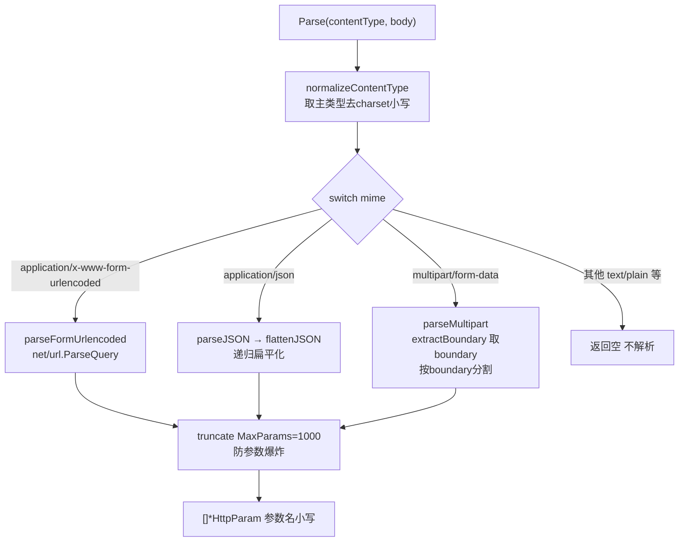

# 请求体解析 BodyParser

> POST/PUT/PATCH 的参数常在请求体里，不在 URL。`BodyParser` 把 body 解析成和查询参数同构的 `[]*HttpParam`。

## 按 Content-Type 分发

源码：[`pkg/request/body_parser.go`](https://github.com/cyberspacesec/reverse-router-tree-skills/blob/main/pkg/request/body_parser.go) · [`Parse` (body_parser.go:32-66)](https://github.com/cyberspacesec/reverse-router-tree-skills/blob/main/pkg/request/body_parser.go#L32-L66)



```
BodyParser.Parse(contentType, body)
        │
        ▼
normalizeContentType (取主类型，去 charset)
        │
        ├─ application/x-www-form-urlencoded → ParseQuery（表单）
        ├─ application/json                  → flattenJSON（递归扁平化）
        ├─ multipart/form-data               → 按 boundary 分割
        └─ 其他（text/plain 等）              → 返回空，不解析
```

::: warning multipart 的 boundary 要从原始 Content-Type 取
`normalizeContentType` 会丢掉 `; boundary=xxx` 参数。所以 `parseMultipart` 在规范化**之前**用 [`extractBoundary` (body_parser.go:192)](https://github.com/cyberspacesec/reverse-router-tree-skills/blob/main/pkg/request/body_parser.go#L192) 从原始 Content-Type 提取 boundary，否则分割不了 part。
:::

## 三种格式

### ① 表单 `application/x-www-form-urlencoded`

源码：[`parseFormUrlencoded` (body_parser.go:77-92)](https://github.com/cyberspacesec/reverse-router-tree-skills/blob/main/pkg/request/body_parser.go#L77-L92)，复用 `net/url.ParseQuery`，支持 URL 解码和多值：

```
body: name=alice&age=30&tag=go&tag=web
        │
        ▼
[{name,alice}, {age,30}, {tag,go}, {tag,web}]
```

### ② JSON `application/json`

源码：[`parseJSON` (body_parser.go:94-103)](https://github.com/cyberspacesec/reverse-router-tree-skills/blob/main/pkg/request/body_parser.go#L94-L103) · [`flattenJSON` (body_parser.go:105-128)](https://github.com/cyberspacesec/reverse-router-tree-skills/blob/main/pkg/request/body_parser.go#L105-L128)

递归扁平化，标量→`name=value`，嵌套对象用点号连接，数组用索引：

```
body: {"user":{"name":"bob","address":{"city":"北京"}},
       "tags":["vip","gold"],
       "active":true}
        │  flattenJSON
        ▼
user.name = bob
user.address.city = 北京     ← 嵌套点号连接
tags.0 = vip                 ← 数组索引
tags.1 = gold
active = true
```

### ③ multipart `multipart/form-data`

按 boundary 分割 part，提取字段值；文件字段以**文件名**为值（不读文件内容）：

```
Content-Type: multipart/form-data; boundary=----xyz
body: ------xyz
      Content-Disposition: form-data; name="username"
      alice
      ------xyz
      Content-Disposition: form-data; name="file"; filename="a.png"
      <binary>
      ------xyz--
        │
        ▼
username = alice
file = a.png          ← 文件字段用 filename 作值
```

## 参数名小写

所有格式的参数名统一小写，和查询参数一致：

```
表单: Name=alice → name=alice
JSON: {"Page":1} → page=1
multipart: field User → user=...
```

## Content-Type 规范化

带 charset 时先取主类型再分发：

```
application/json; charset=utf-8  →  normalizeContentType  →  application/json  →  走 JSON 分支
```

注意：**multipart 的 boundary 从原始 Content-Type 提取**（`extractBoundary`），不能用规范化后的，否则丢了 boundary 参数。

## 安全：MaxParams 防爆炸

恶意 body 可能有几万个字段。`MaxParams`（默认 1000）上限，超过截断，防参数爆炸。

## 与查询参数合并

解析出的 body 参数并入 `allParams`，和查询参数统一进入第 ⑥ 步 `processParams`：

```
POST /api/users?page=1  (Content-Type: application/json, body: {"name":"alice"})

① UrlParser:    查询参数 [page]
② BodyParser:   body 参数 [name]
③ 合并:         allParams = [page, name]
④ processParams:
   users → POST → page[Param], name[Param], application/json[ContentType]
```

## 不支持的类型

`text/plain`、`application/octet-stream` 等不解析，返回空列表（不报错）——body 不是结构化参数载体。

## 下一步

- 参数后续处理 → [查询参数处理](/features/query-params)
- Content-Type 节点 → [9 步逆向流程](/features/reverse-flow)
