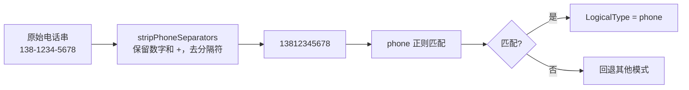

# 中国特有格式识别

> 手机号、身份证号、银行卡号、车牌号——这些中国业务高频格式，靠正则+优先级识别为带语义的逻辑类型。

## 支持的格式

源码：逻辑类型正则表 [`LogicalTypeInferenceRule.initPatterns` (logical_type_inference_rule.go:70-124)](https://github.com/cyberspacesec/reverse-router-tree-skills/blob/main/pkg/inference/logical_type_inference_rule.go#L70-L124)

| 格式 | LogicalType | 正则特征 | 示例 |
|------|-------------|----------|------|
| 手机号 | `phone` | `(?:\+?86\|0086)?1[3-9]\d{9}` | 13812345678, +8613812345678 |
| 座机号 | `phone` | `0\d{2,3}[1-9]\d{6,7}` | 010-12345678, (0755)12345678 |
| 身份证号(18位) | `idcard` | 6地区码+8出生日期+3顺序码+1校验位 | 110101199001011234, ...1X |
| 身份证号(15位) | `idcard` | 6地区码+6出生日期+3顺序码（旧版） | 110101900101123 |
| 银行卡号 | `bankcard` | `[3-6]\d{15,18}` | 6222021234567890123 |
| 车牌号 | `plate` | `[\p{Han}][A-Z][A-Z0-9]{5,6}` | 京A12345, 沪B12345D |

> 手机号和座机号统一为 `phone`——业务上同属电话号码，常混用。

## 模式检测优先级（关键）

PatternDetector 模式顺序**从具体到通用**，具体格式在前，通用 integer 在最后：

```
 1. uuid          ← 最具体
 2. email
 3. ip
 4. date
 5. phone         ← 手机号 11 位特定前缀 / 座机号 0+区号
 6. idcard        ← 18 位含日期
 7. bankcard      ← 16-19 位特定开头
 8. plate         ← 汉字+字母
 9. version
10. alphanumeric
11. float
12. integer       ← 纯数字，最通用，最后
```

为什么重要？身份证号 `110101199001011234` 同时匹配 `integer` 和 `idcard`。如果 integer 在前，身份证号会被当成纯整数，丢掉语义。**具体在前**保证 idcard 优先命中。

多个模式都匹配时，选匹配率最高的；匹配率相同保留先出现的（更具体的）。

## 格式区分机制

### 身份证号 vs 银行卡号

```
身份证号: 1 开头，第 7-14 位是合法出生日期
银行卡号: 3-6 开头，无日期结构
→ 二者正则互斥，不会误判
```

### 手机号 vs 纯整数

```
手机号: 11 位，1 开头，第二位 3-9
纯整数: 任意长度数字
→ 11 位手机号匹配 phone（在前），不回退 integer
```

## 电话号码归一化

源码：[`stripPhoneSeparators` (logical_type_inference_rule.go:246-257)](https://github.com/cyberspacesec/reverse-router-tree-skills/blob/main/pkg/inference/logical_type_inference_rule.go#L246-L257) · [`normalizeForPattern` (logical_type_inference_rule.go:231-243)](https://github.com/cyberspacesec/reverse-router-tree-skills/blob/main/pkg/inference/logical_type_inference_rule.go#L231-L243)

现实里电话号码常带分隔符（用户输入、展示格式），匹配前先归一化：



```
手机号:
  138-1234-5678      → 去横线 → 13812345678 → 匹配 phone
  138 1234 5678      → 去空格 → 13812345678 → 匹配 phone
  (+86)138-1234 5678 → 去分隔符 → +861381234 → 匹配 phone

座机号:
  010-12345678       → 去横线 → 01012345678 → 匹配 phone
  (0755)12345678     → 去括号 → 075512345678 → 匹配 phone
  021 87654321       → 去空格 → 02187654321 → 匹配 phone

归一化规则: 保留数字和 + 号，去除空格、横线、括号、点等分隔符
           (stripPhoneSeparators)
```

## 异常数据兼容

混合合法/非法格式时，靠阈值容忍：

```
/api/users/13812345678   合法手机号
/api/users/15912345678   合法手机号
/api/users/12345678901   非法手机号（第二位是2）
/api/users/18612345678   合法手机号

物理层: phone 匹配率 3/4=0.75, integer 匹配率 4/4=1.0
        → 选 integer（更高匹配率），变量名 {users_id}
逻辑层: phone 匹配率 3/4=0.75 ≥ 0.6 阈值
        → 逻辑类型 = phone

结果: {users_id} [Var, integer, phone]
```

**物理层宽容合并，逻辑层精确标语义**——即使有噪声数据，仍能合并成变量且识别出语义。

## 邮政编码（已移除）

::: warning 邮政编码为什么移除了
邮政编码 `123456` 是 6 位纯数字，但 6 位纯数字无法和普通数字 ID、验证码、订单号区分（`123456` 会被 100% 误判为邮政编码）。误判率太高，所以从自动识别中移除。

当前 6 位数字回退为 `integer`，生成 `{xxx_id}` 变量名。`LogicalTypePostalCode` 常量保留待用——未来若结合参数名语义（参数名叫 `postalcode`/`zip`）可再启用。
:::

## 在 OpenAPI 里输出

逻辑类型决定 OpenAPI schema 的 `format`：

| LogicalType | OpenAPI format |
|-------------|----------------|
| phone | （string，无标准 format，描述标注） |
| email | email |
| uuid | uuid |
| date/datetime | date-time |
| url | uri |
| ipaddress | ipv4 |

详见 [OpenAPI 导出](/features/openapi-export)。

## 下一步

- 类型推断全貌 → [类型推断体系](/architecture/type-inference)
- 长数字串降级 → [长数字串降级](/features/long-number)
