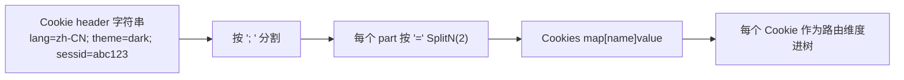

# Cookie 路由

> Cookie 也是路由维度，和 Header 完全对称的两层结构。

## 场景

```
GET /api/home  (Cookie: lang=zh-CN)   → 中文版页面
GET /api/home  (Cookie: lang=en-US)   → 英文版页面
GET /api/shop  (Cookie: theme=dark)   → 暗色主题
GET /api/shop  (Cookie: theme=light)  → 亮色主题
```

多语言、多主题站点常按 Cookie 分流。同一个路径，Cookie 不同 = 不同接口。

## 两层结构

源码：[`RequestCookieNode` (request_cookie_node.go:18-67)](https://github.com/cyberspacesec/reverse-router-tree-skills/blob/main/pkg/node/request_cookie_node.go#L18-L67) · [`RequestCookieValueNode` (request_cookie_node.go:70-125)](https://github.com/cyberspacesec/reverse-router-tree-skills/blob/main/pkg/node/request_cookie_node.go#L70-L125) · `FindOrCreateValueNode` 在 [`request_cookie_node.go:45-60`](https://github.com/cyberspacesec/reverse-router-tree-skills/blob/main/pkg/node/request_cookie_node.go#L45-L60)

```
GET /api/home (Cookie: lang=zh-CN)
GET /api/home (Cookie: lang=en-US)

home
 └─ GET
      └─ lang [Cookie]                      ← 第一层：Cookie 名称分组
           ├─ lang=zh-CN [CookieValue]      ← 第二层：Cookie 值
           └─ lang=en-US [CookieValue]
```

和 [Header 路由](/features/header-routing) 结构完全对称：

| 维度 | 第一层节点 | 第二层节点 |
|------|-----------|-----------|
| Header | `request_header`（名称） | `request_header_value`（值） |
| Cookie | `request_cookie`（名称） | `request_cookie_value`（值） |

## Cookie 解析

源码：[`ParseCookies` (http_headers.go:119-147)](https://github.com/cyberspacesec/reverse-router-tree-skills/blob/main/pkg/request/http_headers.go#L119-L147) · [`Cookies` 类型 (http_headers.go:115)](https://github.com/cyberspacesec/reverse-router-tree-skills/blob/main/pkg/request/http_headers.go#L115)

`ParseCookies()` 解析 Cookie header 字符串：



```
Cookie: lang=zh-CN; theme=dark; sessid=abc123
        │
        ▼ ParseCookies
[{lang, zh-CN}, {theme, dark}, {sessid, abc123}]
        │
        ▼ 每个 Cookie 作为路由维度
home → GET → lang[Cookie] → zh-CN/en-US
                theme[Cookie] → dark/light
```

每个 Cookie 名=值都成为独立的路由维度，全部进树。

## 值节点回填名称

源码：[`NewRequestCookieValueNode` (request_cookie_node.go:80-91)](https://github.com/cyberspacesec/reverse-router-tree-skills/blob/main/pkg/node/request_cookie_node.go#L80-L91) 把 `cookieName` 存入 Value 字段；[`IsMatch` (request_cookie_node.go:103-105)](https://github.com/cyberspacesec/reverse-router-tree-skills/blob/main/pkg/node/request_cookie_node.go#L103-L105) 用精确相等匹配。

和 Header 一样，第二层 `RequestCookieValueNode` 的 Key 是值，Value 字段回填 Cookie 名称：

```
lang=zh-CN [CookieValue]
  Key:   "zh-CN"   ← 用于匹配
  Value: "lang"    ← 回溯到分组名称
```

## 为什么 Cookie 也进树

把 Cookie 纳入路由维度，意味着：

- `IsNeedRequest` 会检查“这个 Cookie 名/值树里有没有”，没有就提示需要请求
- 不同 Cookie 值的接口不会互相覆盖
- 导出 OpenAPI 时 Cookie 路由变成 `parameters[].in = "cookie"` 参数

这样爬虫/扫描器对 Cookie 维度的覆盖也能被追踪，不遗漏。

## 下一步

- Header 路由 → [Header 路由](/features/header-routing)
- Cookie 在 OpenAPI 里怎么输出 → [OpenAPI 导出](/features/openapi-export)
