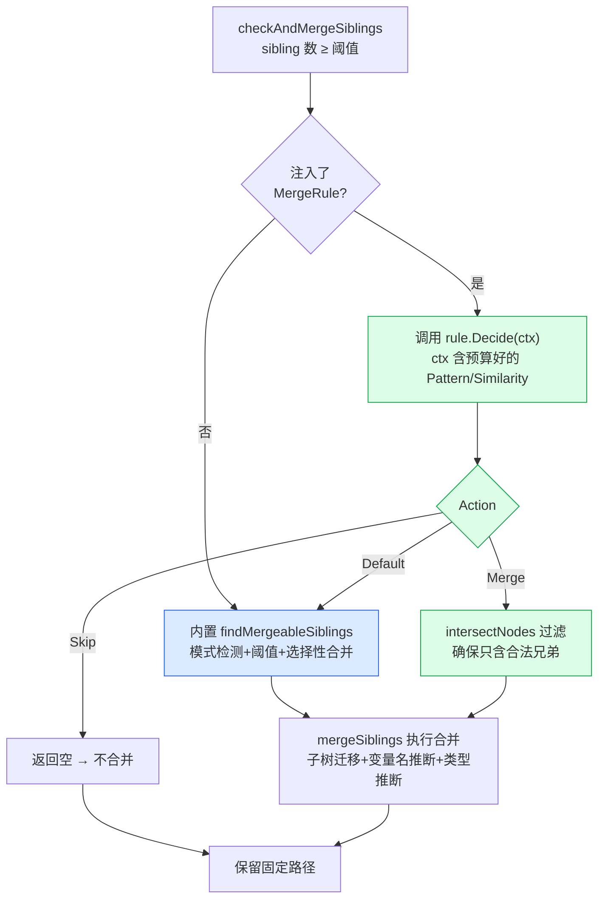

# 自定义合并规则

> 内置合并策略覆盖了通用场景。当你的业务有特殊的"什么算变量"判定时，可以注入自己的合并规则。

::: tip 源码
[`MergeRule` 接口与 `SetMergeRule` (merge_rule.go)](https://github.com/cyberspacesec/reverse-router-tree-skills/blob/main/pkg/router/merge_rule.go) · 调用点 [`findMergeableSiblings` (reverse_router.go)](https://github.com/cyberspacesec/reverse-router-tree-skills/blob/main/pkg/router/reverse_router.go)
:::

## 为什么需要自定义

内置 `findMergeableSiblings` 用一套固定策略：模式检测（12 种结构化模式 + 前缀/后缀 + 相似长度突破）→ 相似度阈值 → 选择性合并子集。这对大多数 RESTful API 够用，但有些业务场景需要专属判定：

- 你的 ID 是某种**业务自定义编码**（如 `ORD-2026-0001`），内置正则没覆盖，但你确定它是变量
- 你的路由里 `admin`/`manager`/`guest` **确实该合并**成一个角色变量（内置会保护它们不合并）
- 你想用**外部知识库**判定（如对照一份已知固定路径清单，不在清单内的才合并）

这时注入一个 `MergeRule`，就能在不改库源码的前提下接管合并决策。

## 接口

```go
// 决策结果
type MergeAction int
const (
    MergeActionDefault MergeAction = iota // 交还内置逻辑判定
    MergeActionMerge                       // 合并 Mergeable 指定的节点子集
    MergeActionSkip                        // 本次跳过合并，全部保留为固定路径
)

// 传给规则的上下文
type MergeContext struct {
    Parent     node.Node[...]  // 合并发生的父节点
    Siblings   []node.Node[...] // 同层全部 request_path 兄弟
    Values     []string         // 兄弟的路径段值，与 Siblings 一一对应
    Pattern    string           // 内置检测器算出的主导模式名
    Similarity float64          // Values 中匹配 Pattern 的比例
    Config     MergeConfig      // 当前合并配置（阈值等）
}

// 规则接口
type MergeRule interface {
    Decide(ctx MergeContext) (action MergeAction, mergeable []node.Node[...])
}
```

关键设计：



注意三点：

1. **规则只决策，不执行**。返回 `MergeActionMerge` 后，实际合并（删旧节点、建变量节点、迁移孙节点、推断类型、统计）仍由内置 `mergeSiblings` 完成——保证行为一致，规则实现简单。
2. **Context 预带检测结果**。`Pattern`/`Similarity` 是内置 `PatternDetector` 算好的，规则可直接用，不必重造模式检测。也可完全忽略自行判定。
3. **`Default` 放行**。规则可只对特定场景接管，其余返回 `Default` 交给内置逻辑。

## 用法

### 场景一：强制不合并某层

某个 parent 下的兄弟你确定都是固定路径，不希望被合并：

```go
type keepAllRule struct{}

func (r *keepAllRule) Decide(ctx MergeContext) (MergeAction, []node.Node[...]) {
    if ctx.Parent.GetKey() == "roles" {
        return MergeActionSkip, nil // roles 下的 admin/manager/guest 全部保留
    }
    return MergeActionDefault, nil // 其余层走内置逻辑
}

r := router.NewReverseRouter()
r.SetMergeRule(&keepAllRule{})
```

### 场景二：合并自定义编码

你的订单号 `ORD-2026-0001` 不在内置模式里，但你确定是变量：

```go
var orderRe = regexp.MustCompile(`^ORD-\d{4}-\d{4}$`)

type orderRule struct{}

func (r *orderRule) Decide(ctx MergeContext) (MergeAction, []node.Node[...]) {
    var mergeable []node.Node[...]
    for i, n := range ctx.Siblings {
        if orderRe.MatchString(ctx.Values[i]) {
            mergeable = append(mergeable, n)
        }
    }
    if len(mergeable) >= 2 {
        return MergeActionMerge, mergeable
    }
    return MergeActionDefault, nil
}

r.SetMergeRule(&orderRule{})
```

合并后变量名会基于父路径 + 模式自动生成（见 [路径变量识别](./path-variable)），`ORD-2026-0001` 这类无内置模式名的值会归为 `integer`/`alphanumeric` 之类，得到 `{orders_id}` 之类的名字。

### 场景三：基于内置结果微调

`Context` 带了 `Pattern`/`Similarity`，你可以"在内置逻辑基础上加一道判断"：

```go
type strictRule struct{}

func (r *strictRule) Decide(ctx MergeContext) (MergeAction, []node.Node[...]) {
    // 内置对 integer 在 similarity>=0.4 就合并，这里要求 >=0.8 才合并
    if ctx.Pattern == "integer" && ctx.Similarity < 0.8 {
        return MergeActionSkip, nil
    }
    return MergeActionDefault, nil
}
```

## 并发安全

`Decide` 在 `checkAndMergeSiblings` 的 `mergeMu` 临界区内被调用，**无需自行加锁**。但规则应当**无状态**——同一输入任何时刻返回同一决策，否则在并发合并下行为不可预测。

`SetMergeRule` 与合并临界区互斥（持 `mergeMu`），确保规则不会在合并执行中途被换；`GetMergeRule` 不持锁以避免重入死锁，最坏仅读到换规则前的旧值。

## 限制

- 规则只决定"**哪些兄弟可合并**"，不能改变合并**执行方式**（变量名生成、子树迁移逻辑不可覆盖）。如需更深定制，需在库内扩展。
- 返回的 `mergeable` 会被 `intersectNodes` 过滤——只保留确属 `Siblings` 的节点，规则返回外部节点会被忽略，防止误操作。
- `MergeActionMerge` 但 `mergeable` 为空时，等同于 `Skip`。

## 下一步

- 内置策略细节 → [选择性合并策略](./selective-merge)
- 模式检测 → [路径变量识别](./path-variable)
- 并发与锁 → [并发设计](/architecture/concurrency)
