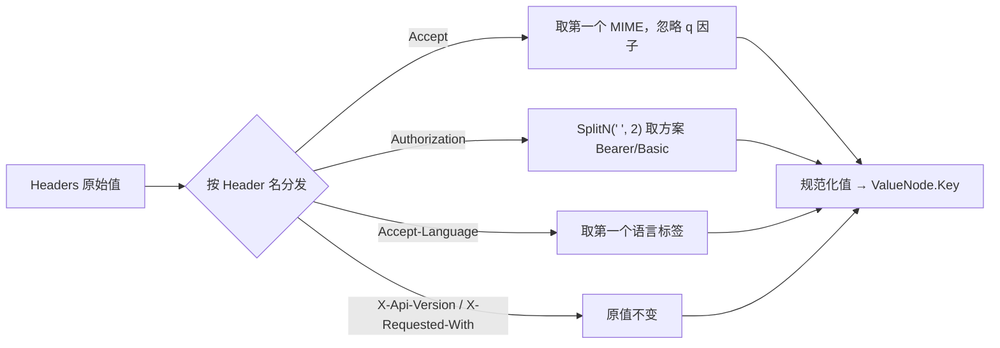

# Header 路由

> 有些 Web 服务按特定 Header 做路由决策。Header 也是路由维度，进树。

## 场景

```
GET /api/data  (Accept: application/json)   → 后端返回 JSON
GET /api/data  (Accept: text/html)          → 后端返回 HTML
POST /api/x    (Authorization: Bearer xxx)  → Bearer 认证流
POST /api/x    (Authorization: Basic xxx)   → Basic 认证流
GET /api/v2/...(X-Api-Version: v2)          → 版本路由
```

同一个路径 + 同一个方法，Header 不同 = 不同接口。

## 支持的 Header

| Header | 路由意义 |
|--------|----------|
| `Accept` | 返回格式分流（JSON/HTML/XML） |
| `Authorization` | 认证方式分流（Bearer/Basic/Token） |
| `X-Api-Version` | API 版本路由 |
| `Accept-Language` | 多语言路由 |
| `X-Requested-With` | Ajax vs 普通请求 |

## 值规范化

源码：[`Headers` 类型与各 getter (http_headers.go:13-98)](https://github.com/cyberspacesec/reverse-router-tree-skills/blob/main/pkg/request/http_headers.go#L13-L98) · [`GetAuthScheme` (http_headers.go:62-73)](https://github.com/cyberspacesec/reverse-router-tree-skills/blob/main/pkg/request/http_headers.go#L62-L73) 取认证方案

相同语义的 Header 值不该创建不同节点。对值规范化：



| Header | 原始值 | 规范化值 | 规则 |
|--------|--------|----------|------|
| Accept | `application/json, text/html;q=0.9` | `application/json` | 取第一个 MIME，忽略 q 因子 |
| Authorization | `Bearer token123` | `Bearer` | 只取认证方案 |
| Accept-Language | `zh-CN,zh;q=0.9` | `zh-CN` | 取第一个语言标签 |
| X-Api-Version | `v2` | `v2` | 原值不变 |
| X-Requested-With | `XMLHttpRequest` | `XMLHttpRequest` | 原值不变 |

## 两层结构

源码：[`RequestHeaderNode` (request_header_node.go:26-67)](https://github.com/cyberspacesec/reverse-router-tree-skills/blob/main/pkg/node/request_header_node.go#L26-L67) · [`RequestHeaderValueNode` (request_header_node.go:76-125)](https://github.com/cyberspacesec/reverse-router-tree-skills/blob/main/pkg/node/request_header_node.go#L76-L125) · `FindOrCreateValueNode` 在 [`request_header_node.go:49-65`](https://github.com/cyberspacesec/reverse-router-tree-skills/blob/main/pkg/node/request_header_node.go#L49-L65)

```
GET /api/data (Accept: application/json)
GET /api/data (Accept: text/html)

data
 └─ GET
      └─ Accept [Header]                      ← 第一层：名称分组
           ├─ Accept: application/json [HeaderValue]   ← 第二层：值
           └─ Accept: text/html [HeaderValue]
```

### 为什么两层

| 设计 | 单层 | 两层（当前） |
|------|------|------|
| 节点 key | `Accept:json`（混杂） | 名称节点 + 值子节点 |
| 查找 | 要知道完整值 | 先按名称找，再按值找 |
| 变量合并 | key 混杂，难合并 | 值是兄弟节点，可合并 |
| 统计 | 只能数总数 | 可分别数“名称数”“值数” |

两层让“同一 Header 的不同值”成为兄弟节点，未来可像路径变量一样合并（比如多个 token 合并成变量）。

## 值节点回填名称

源码：[`NewRequestHeaderValueNode` (request_header_node.go:84-95)](https://github.com/cyberspacesec/reverse-router-tree-skills/blob/main/pkg/node/request_header_node.go#L84-L95) 构造时把 `headerName` 存入 Value 字段；[`String` (request_header_node.go:122-124)](https://github.com/cyberspacesec/reverse-router-tree-skills/blob/main/pkg/node/request_header_node.go#L122-L124) 输出 `name: value [HeaderValue]`。

第二层 `RequestHeaderValueNode` 的 Key 是规范化值，Value 字段回填 Header 名称，便于回溯分组：

```
Accept: application/json [HeaderValue]
  Key:   "application/json"   ← 用于匹配
  Value: "Accept"             ← 回溯到分组名称
```

## 与 Cookie 路由对称

Cookie 路由是完全对称的设计，只是维度换成 Cookie。详见 [Cookie 路由](/features/cookie-routing)。

## 下一步

- Cookie 路由 → [Cookie 路由](/features/cookie-routing)
- Header 在 OpenAPI 里怎么输出 → [OpenAPI 导出](/features/openapi-export)
