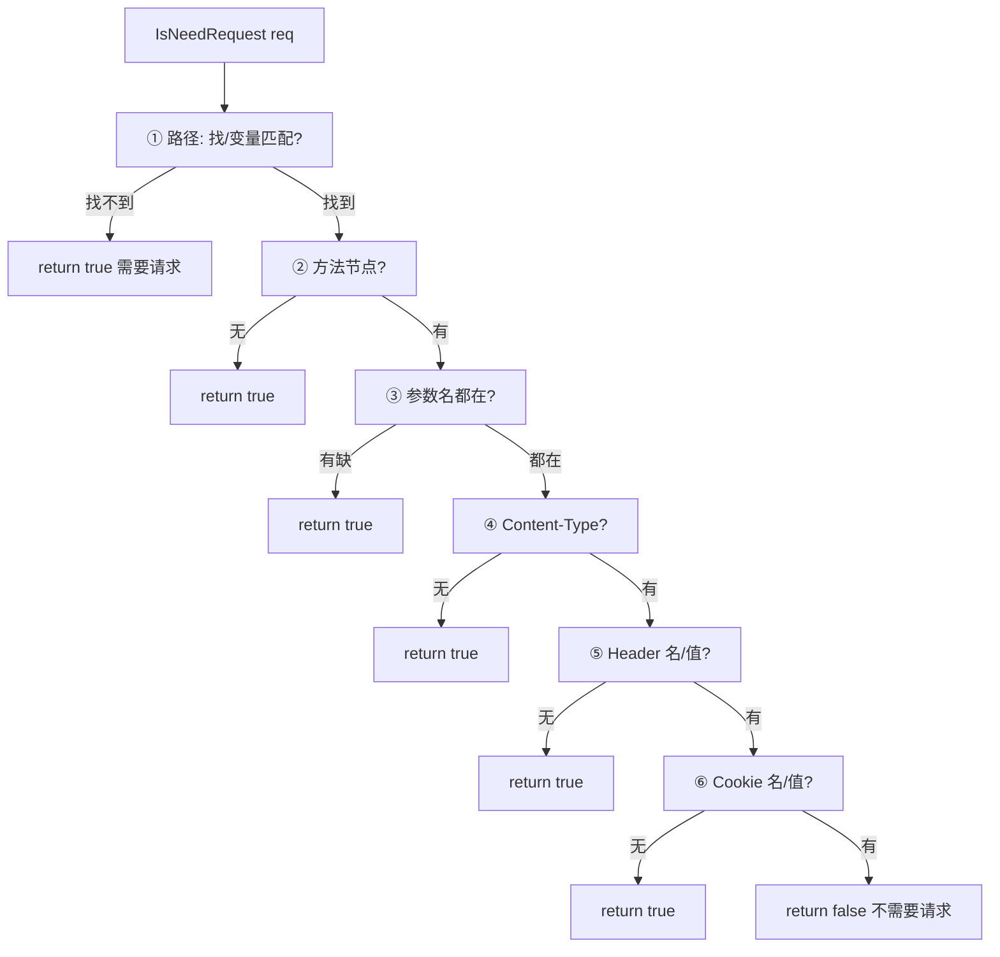
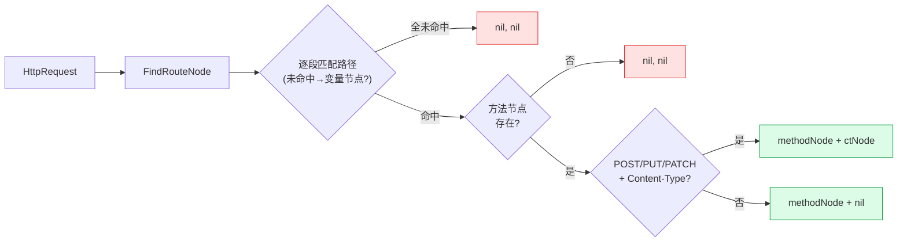

# IsNeedRequest 去重

> `ReverseHttpRequest` 是“把请求记进树”；`IsNeedRequest` 是反过来——“这个请求还需要发吗？”

## 解决的问题

爬虫/扫描器抓到一坨 URL，其中很多是同一个接口的变量值变化：

```
/api/users/123   ← 已记录过 {users_id} 变量，123 已被覆盖
/api/users/456   ← 已被 {users_id} 覆盖
/api/users/789   ← 已被 {users_id} 覆盖
```

这 3 个 URL 进了树之后，再问“还要不要请求？”——答案都是**不需要**，因为路由树里已经有 `/api/users/{users_id}` 了，新值会自动归入变量节点。

## 检查的 6 个维度

源码：[`IsNeedRequest` (reverse_router.go:890-990)](https://github.com/cyberspacesec/reverse-router-tree-skills/blob/main/pkg/router/reverse_router.go#L890-L990)

```go
func (x *ReverseRouter) IsNeedRequest(request *HttpRequest) bool
```



```
请求进来
  │
  ├─① 路径:    找不到对应路径节点 / 变量节点 → 需要请求
  ├─② 方法:    该路径下没有此方法节点 → 需要请求
  ├─③ 参数:    参数名不存在 → 需要请求
  ├─④ CT:      Content-Type 不存在 → 需要请求
  ├─⑤ Header:  Header 名称或值不存在 → 需要请求
  ├─⑥ Cookie:  Cookie 名称或值不存在 → 需要请求
  └─ 全部命中 → 不需要请求
```

**任何一个维度发现"树里还没有"，就短路返回 `true`（需要请求）。** 全部命中才返回 `false`。短路设计保证性能——发现一处缺失立即返回，不查后续维度。

## 例子

```
已构建的树:
root
└── api
    └── users
        └── {users_id} [Var]
            └── GET

IsNeedRequest("/api/users/123", GET)  → false  ← 123 命中 {users_id}，GET 存在
IsNeedRequest("/api/users/999", GET)  → false  ← 999 也命中 {users_id}
IsNeedRequest("/api/users/123", POST)→ true   ← 该路径下还没有 POST
IsNeedRequest("/api/orders/1",  GET) → true   ← 树里根本没有 orders 路径
```

## 价值

```
传统爬虫:                          用了 IsNeedRequest 的爬虫:
  for url in urls:                    for url in urls:
    fetch(url)            ← 1000 次     if router.IsNeedRequest(url):
                                          fetch(url)        ← 只发真正需要的
   1000 次请求                        N 次（N << 1000）
```

把有限的爬取/扫描预算花在**未覆盖的接口**上，而不是反复请求已知接口。

## 与 ReverseHttpRequest 的配合

典型用法是两者配合：

```go
for _, req := range capturedURLs {
	if r.IsNeedRequest(req) {       // 先问：要不要发？
		fetchAndCapture(req)        // 真正去发请求、抓响应
	}
	r.ReverseHttpRequest(req)       // 不管发没发，都把 URL 记进树
}
```

`IsNeedRequest` 只看“树里有没有”，不实际发请求；`ReverseHttpRequest` 只记账。两者解耦，调用方自己决定要不要真发。

## 相关 API：FindRouteNode

`IsNeedRequest` 返回 bool——够用于"要不要发"。但有时你想知道**这个请求会落到哪个具体路由节点**（比如查它的参数定义、命中计数），用 `FindRouteNode`：

```go
// 返回请求命中的方法节点 + Content-Type 子节点（若有）
methodNode, ctNode, err := r.FindRouteNode(req)
if methodNode != nil {
    // 查这个路由的参数、Header、Cookie 子节点
    fmt.Println("命中路由，方法节点：", methodNode.GetKey())
}
```

命中规则与 `ReverseHttpRequest` 的路由构建一致：路径段精确匹配，未命中固定路径时回退到路径变量节点；方法按大写匹配。路径或方法未命中时返回 `nil, nil, nil`（无错误，就是没找到）。



与 `IsNeedRequest` 的关系：`IsNeedRequest` 内部走类似的查找，但它还额外检查参数/Header/Cookie 子维度是否齐全，并看方法节点的请求计数——`FindRouteNode` 只定位节点，不判断"是否需补充采集"。

## 下一步

- 树是怎么记的 → [9 步逆向流程](/features/reverse-flow)
- 参数怎么判必需 → [必需参数推断](/features/required-params)
