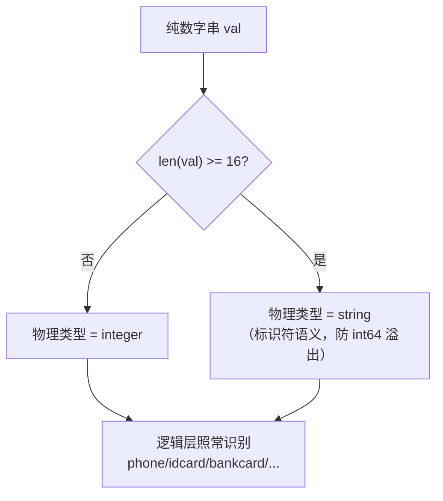

# 长数字串物理类型降级

> 16 位及以上的纯数字，物理类型降级为 `string` 而非 `integer`。

## 规则

源码：[`physical_type_inference_rule.go:219-236`](https://github.com/cyberspacesec/reverse-router-tree-skills/blob/main/pkg/inference/physical_type_inference_rule.go#L219-L236) ——纯数字串 `len(val) >= 16` 时返回 `string`，不再识别为 `integer`。



| 长度 | 示例 | 物理类型 | 逻辑类型 |
|------|------|----------|----------|
| ≤15 位 | `13812345678`（手机号11位） | integer | phone |
| ≥16 位 | `110101199001011234`（身份证18位） | **string** | idcard |
| ≥16 位 | `6222021234567890123`（银行卡19位） | **string** | bankcard |
| >19 位 | `1234567890123456789012345`（超长ID25位） | **string** | string |

## 为什么降级

三个理由：

### ① 标识符语义，不是算术整数

```
身份证号 110101199001011234  ← 你不会拿它做加减乘除
银行卡号 6222021234567890123 ← 同上
超长ID  1234567890123456789012345
```

这些长数字本质是**标识符**，业务系统普遍以 string 存储（数据库、JSON、ORM 都是）。标成 integer 误导调用方以为可做算术。

### ② int64 溢出风险

```
int64 最大值 = 9223372036854775807  （19位）
```

16 位以上纯数字就可能超过 int64 上限，标成 integer 会有溢出风险——调用方解析成 int64 时崩溃。

### ③ 16 位是合理分界线

- ≤15 位：手机号（11位）、普通业务 ID（如自增主键）——算术整数合理
- ≥16 位：银行卡（16-19）、身份证（18）、超长 ID（>19）——标识符

16 位是“算术整数”与“标识符数字串”的经验分界线。

## 逻辑层仍识别语义

降级只影响**物理类型**，**逻辑类型照常识别**：

```
身份证号 110101199001011234
  ├─ 物理类型: string     ← 降级
  └─ 逻辑类型: idcard     ← 仍精确识别

银行卡号 6222021234567890123
  ├─ 物理类型: string     ← 降级
  └─ 逻辑类型: bankcard   ← 仍精确识别
```

两层推断协同：物理层降级保安全，逻辑层标语义保信息不丢。

## OpenAPI 输出

```json
// 身份证号
{ "type": "string", "description": "路径变量, 物理类型: string" }

// 短数字（手机号场景）
{ "type": "integer", "pattern": "[0-9]+" }
```

详见 [OpenAPI 导出](/features/openapi-export)。

## 下一步

- 中国格式识别 → [中国特有格式](/features/china-formats)
- 类型推断全貌 → [类型推断体系](/architecture/type-inference)
