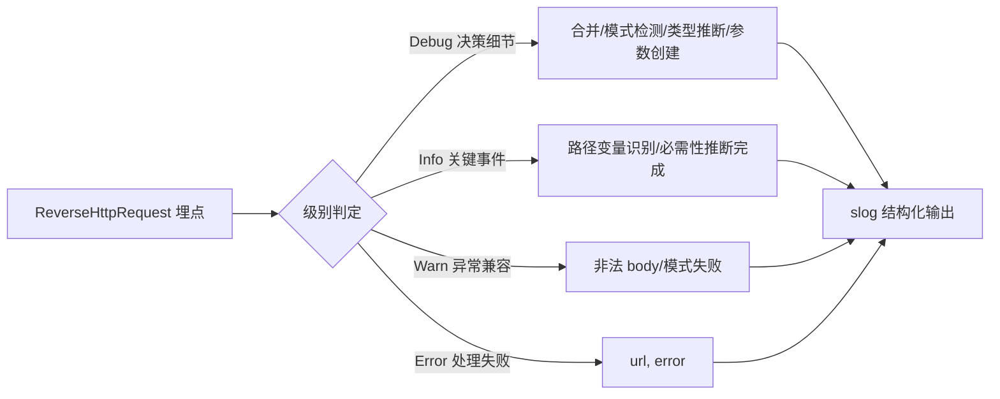

# 日志与统计

> 逆向过程是黑盒的。日志让过程**可追踪**，统计让效果**可量化**。

## 两层可观测性

```
┌──────────────────────────────────────────────────┐
│  RouterLogger  结构化日志（log/slog）            │
│   五级：Debug / Info / Warn / Error / Off        │
│   默认 Warn（低噪音），调试时开 Debug 看全链路    │
├──────────────────────────────────────────────────┤
│  RouterStats   11 项 atomic 计数指标             │
│   量化逆向效果，可 JSON 序列化上报监控            │
└──────────────────────────────────────────────────┘
```

## 结构化日志 RouterLogger

源码：[`RouterLogger` 类型与构造 (logger.go:28-90)](https://github.com/cyberspacesec/reverse-router-tree-skills/blob/main/pkg/router/logger.go#L28-L90) · 五级定义 [`LogLevel` (logger.go:12-26)](https://github.com/cyberspacesec/reverse-router-tree-skills/blob/main/pkg/router/logger.go#L12-L26)；统计计数器与快照见 [`GetStats` (reverse_router.go:153-155)](https://github.com/cyberspacesec/reverse-router-tree-skills/blob/main/pkg/router/reverse_router.go#L153-L155) · [`ResetStats` (reverse_router.go:158-160)](https://github.com/cyberspacesec/reverse-router-tree-skills/blob/main/pkg/router/reverse_router.go#L158-L160)

封装 Go 标准库 `log/slog`，输出带时间戳的键值对：



```
time=2026-07-01T15:35:39 level=INFO msg=识别路径变量 parent=users var_name=users_id pattern=integer physical_type=integer logical_type=string merged_count=3
time=2026-07-01T15:35:39 level=WARN msg=解析请求体参数失败 url=/api/x content_type=application/json error="解析JSON失败: ..."
```

### 五级日志

| 级别 | 用途 | 默认输出 |
|------|------|----------|
| Debug | 决策细节：每次合并、模式检测、类型推断、参数创建 | 否 |
| Info | 关键事件：路径变量识别、必需性推断完成 | 否 |
| Warn | 异常兼容：非法 body、模式匹配失败 | **是** |
| Error | 处理失败 | **是** |
| Off | 关闭 | — |

默认 **Warn**：生产环境只看到真正需要关注的事件（异常 body、错误）。调试逆向过程时 `SetLogLevel(LogLevelDebug)` 看全部决策。

### 埋点位置

```
ReverseHttpRequest:
  ├─ 请求开始/完成   (Debug)  url, method, 参数数, body参数数
  ├─ 路径变量识别    (Info)   parent, var_name, pattern, physical/logical_type, merged_count
  ├─ 模式检测        (Debug)  parent, pattern, similarity, values数
  ├─ 合并决策        (Debug)  尝试(parent,children数) / 跳过(可合并不足)
  ├─ 参数创建        (Debug)  method, param, value, physical/logical_type
  ├─ 必需性推断      (Info)   required_count, threshold；Debug 记每个必需参数
  ├─ 异常 body       (Warn)   url, content_type, error
  └─ 处理错误        (Error)  url, error
```

## 可观测性统计 RouterStats

11 项 `atomic.Int64` 计数器，线程安全，量化逆向效果：

| 指标 | 含义 |
|------|------|
| `requests_processed` | 已处理请求总数 |
| `path_variables_identified` | 识别的路径变量数（合并成功） |
| `pattern_detections` | 模式检测调用次数 |
| `params_created` | 创建的参数节点数 |
| `type_inferences` | 类型推断调用次数 |
| `body_params_parsed` | 从请求体解析的参数总数 |
| `required_params_inferred` | 推断为必需的参数数 |
| `merge_attempts` / `merge_skipped` | 合并尝试 / 跳过次数 |
| `warnings` / `errors` | 警告 / 错误事件数 |

### 用法

```go
r.InferRequiredParams()
stats := r.GetStats()           // 返回快照（值类型）
data, _ := json.Marshal(stats)  // 可序列化用于监控上报
fmt.Println(stats)              // requests=1000, path_vars=12, params=45, ...
r.ResetStats()                  // 清零重新统计
```

### 怎么读这些指标

```
处理 1000 个请求 → 识别 12 个路径变量、创建 45 个参数、5 次合并跳过（固定路径）
→ 必需参数推断：8 个必需 → 警告 2（异常 body 已兼容）→ 错误 0
```

| 指标组合 | 解读 |
|----------|------|
| `merge_skipped` 高 | 大量固定路径未被误合并（**健康**） |
| `warnings` 反映 | 异常数据兼容次数 |
| `path_variables_identified / requests_processed` | 变量识别密度 |
| `errors` 非 0 | 有请求处理失败，需排查 |

## 配置 API

```go
r.SetLogLevel(router.LogLevelDebug)   // 开调试日志
r.SetLogger(customLogger)             // 自定义日志器（传 nil 关闭日志）
r.SetLogger(router.NewRouterLoggerWithLevel(router.LogLevelInfo, os.Stdout))

stats := r.GetStats()                 // 统计快照
r.ResetStats()                        // 清零
```

## 下一步

- 并发安全实现 → [并发设计](/architecture/concurrency)
- 9 步流程的埋点 → [9 步逆向流程](/features/reverse-flow)
