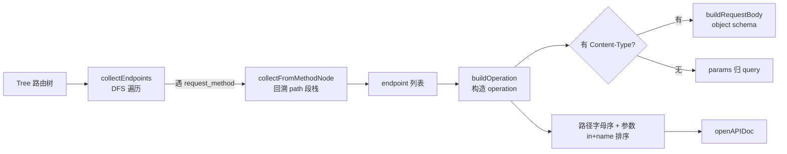
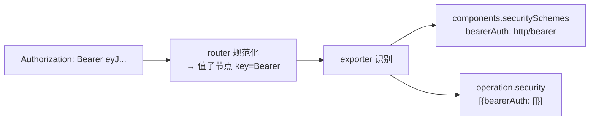

# OpenAPI 导出

> `pkg/exporter.OpenAPIExporter` 把路由树导出为标准 OpenAPI 3.0.3，Swagger UI / Redoc 直接渲染。

## 核心映射

源码：[`pkg/exporter/openapi.go`](https://github.com/cyberspacesec/reverse-router-tree-skills/blob/main/pkg/exporter/openapi.go) · 入口 [`Export` (openapi.go:131-163)](https://github.com/cyberspacesec/reverse-router-tree-skills/blob/main/pkg/exporter/openapi.go#L131-L163)



```
路由树节点                              OpenAPI 3.0.3
─────────────────                      ──────────────────────────────────
request_path + path_variable   →       paths: { "/api/users/{users_id}": {...} }
request_method                 →       pathItem.get / post / put / delete / ...
request_param (无 CT)          →       parameters[].in = "query"
request_path_variable          →       parameters[].in = "path" (required=true)
request_header                 →       parameters[].in = "header" (同名去重)
request_cookie                 →       parameters[].in = "cookie" (同名去重)
request_content_type + body    →       requestBody.content[ct].schema (object)
```

## 路径变量还原

源码：[`collectEndpoints` (openapi.go:203-231)](https://github.com/cyberspacesec/reverse-router-tree-skills/blob/main/pkg/exporter/openapi.go#L203-L231) · [`collectFromMethodNode` (openapi.go:234-295)](https://github.com/cyberspacesec/reverse-router-tree-skills/blob/main/pkg/exporter/openapi.go#L234-L295)

DFS 遍历遇 `request_method` 节点时，回溯路径段栈构造完整 path；路径变量段记为 `{key}` 并保留类型信息：

```
路由树:                              OpenAPI:
api → users → {users_id} → GET      paths:
                                      "/api/users/{users_id}":
                                        get:
                                          parameters:
                                            - name: users_id
                                              in: path
                                              required: true        ← 路径变量恒必需
                                              schema:
                                                type: integer
                                                pattern: "[0-9]+"
```

固定路径（`list`/`create`）原样保留为独立 path。

## 参数分类

```
                有 Content-Type 节点？
                       │
              ┌────────┴────────┐
             是                  否
              │                  │
              ▼                  ▼
        归入 requestBody    归入 query 参数
        (POST body schema)
```

- **query**：方法节点下无 Content-Type 的参数
- **path**：路径变量（`required: true`）
- **header**：从两层 Header 结构子节点收集，同名去重
- **cookie**：从两层 Cookie 结构子节点收集，同名去重

## 安全方案推断

抓包流量里的 `Authorization` 头会被 router 规范化（提取方案名：`Bearer xxx` → `Bearer`）。导出时据此生成 OpenAPI 安全方案：



- 仅识别 OpenAPI 3.0.3 标准 **http 方案**：`Bearer` / `Basic` / `Digest`
- 识别后 `Authorization` 不再作为普通 header 参数输出（避免与 security 重复）
- 未识别的方案（如自定义 `Token xxx`）回退为普通 header 参数，不生成 security

> 从黑盒流量只能看到 Authorization 头的存在与方案名，无法判断是否为 OAuth2/JWT 等更具体机制，故统一映射为 `http` 方案。

## 请求体 schema

源码：[`buildRequestBody` (openapi.go:379-412)](https://github.com/cyberspacesec/reverse-router-tree-skills/blob/main/pkg/exporter/openapi.go#L379-L412)

POST/PUT/PATCH 的 body 参数生成 object schema：

```json
"requestBody": {
  "content": {
    "application/json": {
      "schema": {
        "type": "object",
        "properties": {
          "name": { "type": "string" },
          "age":  { "type": "integer" }
        },
        "required": ["name"]
      }
    }
  }
}
```

Content-Type 去 charset 规范化：`application/json; charset=utf-8` → `application/json`。`required` 数组来自 `RequestParamNode` 的必需性标记（[必需参数推断](/features/required-params)）。

## 类型映射

源码：[`buildSchema` (openapi.go:428-502)](https://github.com/cyberspacesec/reverse-router-tree-skills/blob/main/pkg/exporter/openapi.go#L428-L502) · [`schemaForParam`](https://github.com/cyberspacesec/reverse-router-tree-skills/blob/main/pkg/exporter/openapi.go#L414) · [`schemaForPathVariable`](https://github.com/cyberspacesec/reverse-router-tree-skills/blob/main/pkg/exporter/openapi.go#L419)

逻辑类型优先决定 `format`，回退到物理类型：

| LogicalType | OpenAPI type | format |
|-------------|--------------|--------|
| date | string | date |
| datetime | string | date-time |
| time | string | time |
| email | string | email |
| url | string | uri |
| uuid | string | uuid |
| ipaddress | string | ipv4 |
| phone/idcard/bankcard/plate | string | —（描述标注） |
| integer/int | integer | — |
| float/decimal/currency/percentage | number | — |
| boolean | boolean | — |
| （无逻辑类型，回退物理） | 按物理类型 | — |

## operationId 自动生成

```
operationId = {method}_{sanitized_path}

GET  /api/users/{users_id}  →  get_api_users_users_id
POST /api/users             →  post_api_users
```

`sanitized` 把路径里的 `/`、`{`、`}` 替换成 `_`，保证合法标识符。

## 稳定排序

输出按字母序稳定排列，多次导出结果一致：

```
paths 按路径字母序:   /api/users → /api/users/{id} → /api/orders
parameters 按 in+name:  path 参数 → query 参数 → header → cookie
```

稳定输出便于 diff、版本对比、CI 校验。

## 真实输出示例

```json
{
  "openapi": "3.0.3",
  "info": {
    "title": "Demo API",
    "version": "1.0.0"
  },
  "paths": {
    "/api/users/{users_id}": {
      "get": {
        "operationId": "get_api_users_users_id",
        "parameters": [
          {
            "name": "users_id",
            "in": "path",
            "required": true,
            "schema": { "type": "integer", "pattern": "[0-9]+" }
          },
          {
            "name": "page",
            "in": "query",
            "schema": { "type": "integer", "default": "1" }
          }
        ],
        "responses": {
          "200": { "description": "成功响应（逆向推断，未经实际验证）" }
        }
      }
    }
  }
}
```

## 配置

```go
e := exporter.NewOpenAPIExporter()
e.Title = "My API"
e.Version = "2.0.0"
e.Description = "从流量逆向的 API"
e.ServerURL = "https://api.example.com"          // 输出 servers
e.IncludeOptionalParameters = false               // 只导出必需参数
out, err := e.Export(r.Tree)
```

## 用法

```go
r.InferRequiredParams()                       // 先推断必需性
e := exporter.NewOpenAPIExporter()
out, _ := e.Export(r.Tree)
os.WriteFile("openapi.json", out, 0644)       // 喂给 Swagger UI / Redoc
```

::: tip 响应是推断的
逆向出来的 OpenAPI 没有 schema 验证过的响应结构。`responses` 里只有占位的 `200` 描述“成功响应（逆向推断，未经实际验证）”。要完整响应 schema 需结合响应体解析（未来增强）。
:::

## 下一步

- 序列化（内部格式） → [路由树序列化](/features/serialization)
- 必需性怎么来的 → [必需参数推断](/features/required-params)
