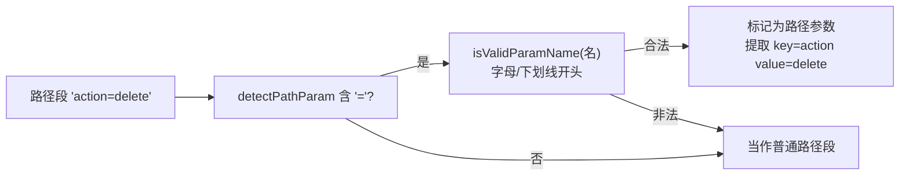

# 路径边界条件

> 真实流量里的 URL 长得千奇百怪。这一页讲各种边界情况怎么处理。

## 边界条件总表

源码：尾部/连续斜杠在 [`normalizePath` (tree.go:198-225)](https://github.com/cyberspacesec/reverse-router-tree-skills/blob/main/pkg/tree/tree.go#L198-L225) 与 [`UrlParser.Parse` (url_parser.go:16-55)](https://github.com/cyberspacesec/reverse-router-tree-skills/blob/main/pkg/request/url_parser.go#L16-L55)；URL 解码/路径遍历在 [`normalizePathSegment` (url_parser.go:62)](https://github.com/cyberspacesec/reverse-router-tree-skills/blob/main/pkg/request/url_parser.go#L62)；文件扩展名在 [`hasFileExtension` (request_path_variable_node.go:105-123)](https://github.com/cyberspacesec/reverse-router-tree-skills/blob/main/pkg/node/request_path_variable_node.go#L105-L123)；路径参数在 [`detectPathParam` (http_request_path.go:22-43)](https://github.com/cyberspacesec/reverse-router-tree-skills/blob/main/pkg/request/http_request_path.go#L22-L43)

| 边界条件 | 示例 | 处理方式 | 处理位置 |
|----------|------|----------|----------|
| 尾部斜杠 | `/api/users/` | `Trim(path, "/")` 去掉 | `UrlParser.Parse()` |
| 连续斜杠 | `//api///users` | 循环替换 `//`→`/` | `UrlParser.Parse()` |
| URL 编码 | `/api/%E7%94%A8%E6%88%B7` | `url.PathUnescape()` 解码 → `/api/用户` | `normalizePathSegment()` |
| 路径遍历 | `/api/../etc/passwd` | `.` 和 `..` 段过滤忽略 | `normalizePathSegment()` |
| 文件扩展名 | `/api/data.json` | 排除，不作为变量 | `hasFileExtension()` |
| 路径参数 | `/api/action=delete` | 识别为参数 | `HttpRequestPath.detectPathParam()` |
| 大小写敏感 | `/API/Users` | 路径**区分大小写**（保留原样） | — |

## 尾部斜杠 & 连续斜杠

```
/api/users/      → Trim("/")    → /api/users
//api///users    → 替换 // → /  → /api/users
/api//users/     → 两者都处理   → /api/users
```

统一规范化后，`/api/users`、`/api/users/`、`//api/users` 进同一个节点，不重复建。

## URL 编码

```
/api/%E7%94%A8%E6%88%B7/123
        │  url.PathUnescape()
        ▼
/api/用户/123
        │
        ▼
路径段: ["api", "用户", "123"]
```

中文、特殊字符自动解码，避免编码差异导致同一路径建多个节点。

## 路径遍历

```
/api/../etc/passwd
/api/./config
        │  normalizePathSegment 过滤 . 和 ..
        ▼
["api"]   ← .. 和 . 段被忽略
```

安全处理，防止路径遍历字符串污染路由树。

## 文件扩展名排除

有扩展名的路径段通常是固定资源（不是变量）：

```
/api/data.json    ← .json 扩展名，不识别为变量，作为固定路径
/api/data.xml     ← 同上
/api/style.css    ← .css，固定路径
/api/report.pdf   ← .pdf，固定路径

/api/123          ← 无扩展名，纯数字，可识别为变量
/api/abc          ← 无扩展名，长度相似串，可能变量
```

::: tip 有正则模式的变量不检查扩展名
如果变量节点已有模式正则（如 `[0-9]+`），`IsMatch` 优先用正则，不检查扩展名。即模式优先于扩展名排除。
:::

## 路径参数（key=value）

源码：[`detectPathParam` (http_request_path.go:22-43)](https://github.com/cyberspacesec/reverse-router-tree-skills/blob/main/pkg/request/http_request_path.go#L22-L43) · 合法参数名校验 [`isValidParamName` (http_request_path.go:44-60)](https://github.com/cyberspacesec/reverse-router-tree-skills/blob/main/pkg/request/http_request_path.go#L44-L60)

某些路径段直接嵌 `key=value`（Spring 路径参数风格）：



这样 `/api/action=delete` 和 `/api/action=create` 走同一个 `action` 参数节点，而不是建两个不同路径。

## 路径大小写：区分

注意：**路径段区分大小写**（不像参数名小写化）：

```
/api/Users   和   /api/users   是两个不同路径节点
```

因为 HTTP 路径语义上区分大小写（`/Users` 和 `/users` 可能是不同路由），保留原样。只有**参数名**不区分大小写（统一小写），路径段不动。

## 下一步

- 参数名为什么小写 → [查询参数处理](/features/query-params)
- 变量节点匹配 → [路径变量识别](/features/path-variable)
