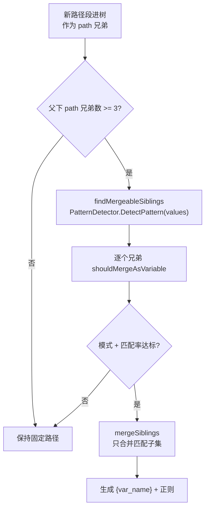
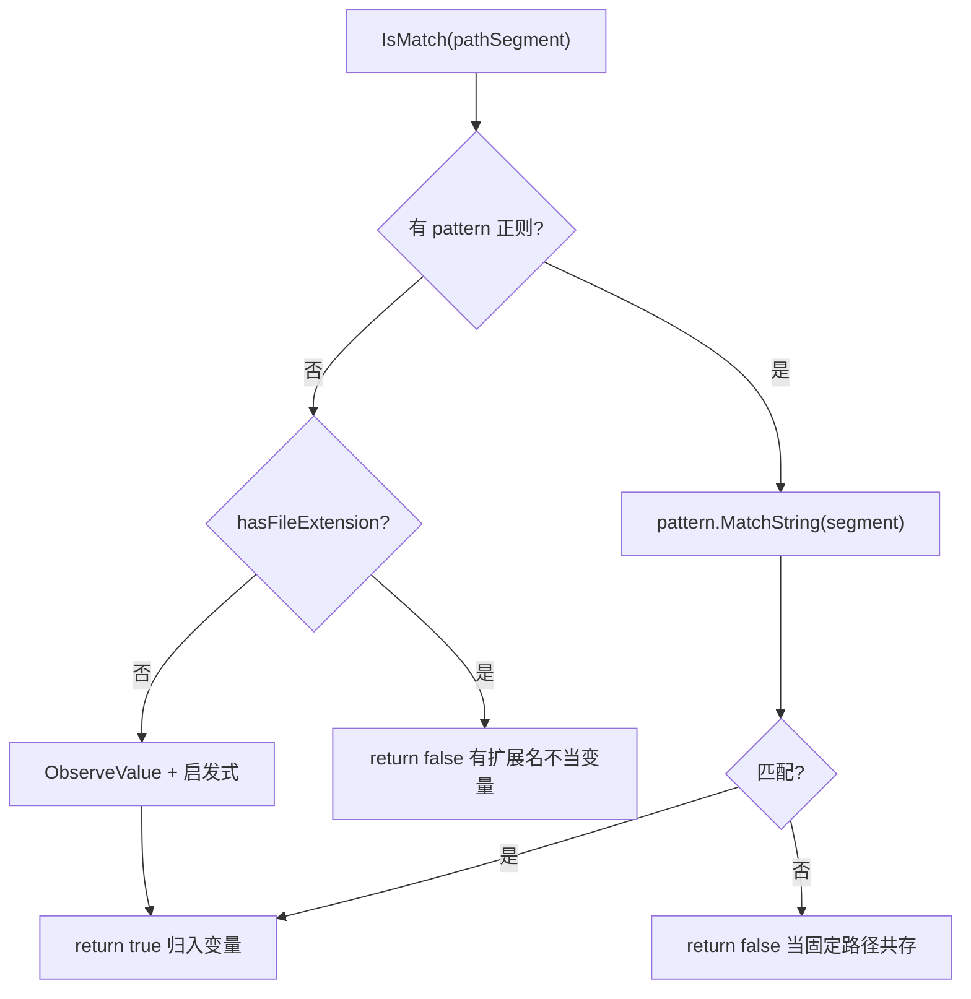

# 路径变量识别

> `/api/users/123` 凭什么被识别成变量？这一页讲透。

## 问题

抓到的路径里，有些段是固定功能名，有些段是变量值：

```
/api/users/123     ← 123 是用户 ID（变量）
/api/users/list    ← list 是固定功能（不是变量）
/api/users/456     ← 456 是用户 ID（变量）
```

**怎么区分“变量值”和“固定路径名”？** 不能靠人工，得靠模式。

## 识别思路

源码：触发与检测在 [`checkAndMergeSiblings` (reverse_router.go:296-321)](https://github.com/cyberspacesec/reverse-router-tree-skills/blob/main/pkg/router/reverse_router.go#L296-L321) · [`findMergeableSiblings` (reverse_router.go:326-372)](https://github.com/cyberspacesec/reverse-router-tree-skills/blob/main/pkg/router/reverse_router.go#L326-L372) · 检测器 [`NewPatternDetector` (reverse_router.go:395-433)](https://github.com/cyberspacesec/reverse-router-tree-skills/blob/main/pkg/router/reverse_router.go#L395-L433)



```
同一个父节点下的兄弟路径段
        │
        ▼
统计：它们符合哪种模式？
  ├─ 全是纯数字 → integer 模式
  ├─ 全是 UUID  → uuid 模式
  ├─ 全是手机号 → phone 模式
  ├─ user_001/user_002 → 前缀模式
  └─ admin/manager/guest → similar_length_strings 模式
        │
        ▼
兄弟数 >= 阈值(3) 且 匹配率达标 → 合并成变量节点
```

**关键洞察**：固定路径名（`list`/`create`）很少有 3 个以上同层兄弟；而 ID、UUID 这类变量值往往大量同层出现。**"数量 + 模式"** 是区分变量与固定路径的信号。

## PatternDetector 模式

源码：[`PatternDetector` 类型定义 (reverse_router.go:386-395)](https://github.com/cyberspacesec/reverse-router-tree-skills/blob/main/pkg/router/reverse_router.go#L386-L395) · [`DetectPattern` (reverse_router.go:435-490)](https://github.com/cyberspacesec/reverse-router-tree-skills/blob/main/pkg/router/reverse_router.go#L435-L490)

检测器按**从具体到通用**的顺序尝试，具体模式在前，避免身份证号被误判成纯整数：

```
1. uuid          ← 最具体，有明确结构
2. email
3. ip
4. date
5. phone         ← 手机号 11 位特定前缀 / 座机号 0+区号
6. idcard        ← 18 位含日期
7. bankcard      ← 16-19 位特定开头
8. plate         ← 汉字+字母
9. version
10. alphanumeric
11. float
12. integer      ← 纯数字，最通用，放最后
```

当多个模式都匹配（如身份证号同时匹配 integer 和 idcard），选匹配率最高的；匹配率相同保留先出现的（更具体的）。

## 变量名生成

源码：[`inferVariableName` (reverse_router.go:605-633)](https://github.com/cyberspacesec/reverse-router-tree-skills/blob/main/pkg/router/reverse_router.go#L605-L633) · 带上下文版 [`inferVariableNameWithContext` (reverse_router.go:636-657)](https://github.com/cyberspacesec/reverse-router-tree-skills/blob/main/pkg/router/reverse_router.go#L636-L657)

合并后变量叫什么？规则：**父路径名 + 语义后缀**：

```
/api/users/123          → {users_id}     (父 users + _id)
/api/orders/1001        → {orders_id}
/api/phones/13812345678 → {phones_phone} (匹配 phone 模式 → 后缀 _phone)
```

这样不同位置的变量不会撞名，且名字带语义提示。

## IsMatch：变量节点怎么匹配新值

源码：[`RequestPathVariableNode.IsMatch` (request_path_variable_node.go:86-110)](https://github.com/cyberspacesec/reverse-router-tree-skills/blob/main/pkg/node/request_path_variable_node.go#L86-L110) · [`hasFileExtension` (request_path_variable_node.go:114-132)](https://github.com/cyberspacesec/reverse-router-tree-skills/blob/main/pkg/node/request_path_variable_node.go#L114-L132)



```
PathVariableNode.IsMatch(segment)
        │
        ├─ 有模式正则？ ─是─▶ 严格用正则匹配
        │                    "123" 匹配 [0-9]+ → true
        │                    "abc" 不匹配 [0-9]+ → false
        │
        └─ 无模式？      ─▶ 启发式：先查 hasFileExtension，是数字/UUID 等可变特征？
```

有模式时严格匹配，保证 `123`/`456` 归入变量，而 `special` 这种不匹配的值作为固定路径**共存**（软回退，不破坏已有合并）。

## 文件扩展名排除

源码：[`hasFileExtension` (request_path_variable_node.go:114-132)](https://github.com/cyberspacesec/reverse-router-tree-skills/blob/main/pkg/node/request_path_variable_node.go#L114-L132) 检查段是否含 `.` 分隔的扩展名。

有扩展名的路径段（`data.json`、`style.css`）通常是固定资源，不作为变量：

```
/api/data.json     ← .json 扩展名，不识别为变量
/api/data.xml      ← 同上，作为固定路径
/api/123           ← 无扩展名，纯数字，可识别为变量
```

但**有正则模式的变量节点不检查扩展名**（模式优先）。

## 一个完整例子

```
输入请求:
/api/users/123
/api/users/456
/api/users/789
/api/users/list
/api/users/create

过程:
1. 123/456/789 进树，作为路径兄弟
2. 兄弟数达到 SiblingMergeThreshold(3) 即触发合并检查（本例共 5 个兄弟）
3. PatternDetector 检测 5 个兄弟：
     list   → 不匹配 integer
     create → 不匹配 integer
     123/456/789 → 匹配 integer，匹配率 3/5 = 0.6 ≥ 0.4（integer 是明确模式，降阈到 0.4）
4. 选择性合并：只合并 123/456/789，保留 list/create
5. 生成变量 {users_id}，模式 [0-9]+

结果:
users
 ├─ list    [Path]          ← 保留
 ├─ create  [Path]          ← 保留
 └─ {users_id} [Var, integer]  ← 合并
```

## 下一步

- 为什么 list/create 不会被吞 → [选择性合并](/features/selective-merge)
- user_001 这种怎么合并 → [前缀/后缀合并](/features/prefix-suffix-merge)
