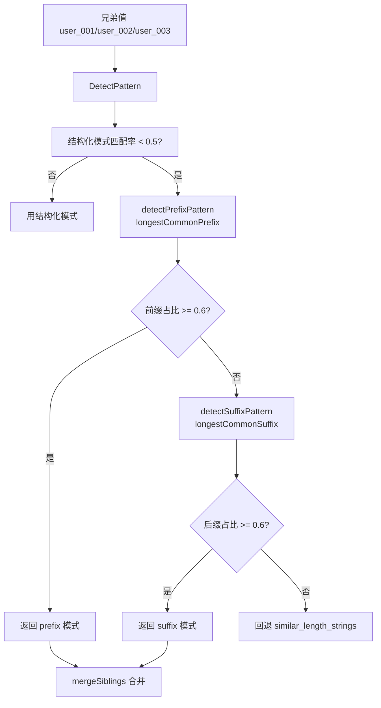

# 前缀/后缀合并

> `user_001`/`user_002`/`user_003` 不是纯数字、不是 UUID，但有明显的公共前缀——这种怎么合并？

## 现实场景

业务命名常出现“固定前缀 + 变量后缀”或“变量前缀 + 固定后缀”：

```
前缀模式:                         后缀模式:
/api/user_001                     /api/001_user
/api/user_002                     /api/002_user
/api/user_003                     /api/003_user
```

这些没有结构化模式（不像纯数字/UUID 有明确格式），但**有公共子串**。

## 触发条件

源码：[`DetectPattern` (reverse_router.go:435-490)](https://github.com/cyberspacesec/reverse-router-tree-skills/blob/main/pkg/router/reverse_router.go#L435-L490) · [`detectPrefixPattern` (reverse_router.go:1019-1055)](https://github.com/cyberspacesec/reverse-router-tree-skills/blob/main/pkg/router/reverse_router.go#L1019-L1055) · [`detectSuffixPattern` (reverse_router.go:1057-1089)](https://github.com/cyberspacesec/reverse-router-tree-skills/blob/main/pkg/router/reverse_router.go#L1057-L1089)

在 `DetectPattern` 中，当结构化模式（integer/uuid/phone 等）匹配率不足（`< 0.5`）时，回退检测前缀/后缀：



```
兄弟值: user_001, user_002, user_003
        │
        ├─ 结构化模式匹配率 < 0.5？
        │     integer: 0（都不是纯数字）, uuid: 0 ...
        │     → 是，回退
        │
        ▼
检测公共前缀:
  user_001 ┐
  user_002 ├─ 公共前缀 "user_"  长度 5
  user_003 ┘  值总长 8  → 前缀占比 5/8 = 0.625 ≥ 0.6 → 合并！
        │
        ▼
合并为 {user_id} [Var, string], 正则 user_[0-9]+
```

## 变量名生成

源码：[`inferVariableNameWithContext` (reverse_router.go:636-657)](https://github.com/cyberspacesec/reverse-router-tree-skills/blob/main/pkg/router/reverse_router.go#L636-L657) · [`trimTrailingSeparator` (reverse_router.go:712-724)](https://github.com/cyberspacesec/reverse-router-tree-skills/blob/main/pkg/router/reverse_router.go#L712-L724) · [`trimTrailingDigits` (reverse_router.go:1129-1137)](https://github.com/cyberspacesec/reverse-router-tree-skills/blob/main/pkg/router/reverse_router.go#L1129-L1137) · 公共前缀 [`longestCommonPrefix` (reverse_router.go:1090-1127)](https://github.com/cyberspacesec/reverse-router-tree-skills/blob/main/pkg/router/reverse_router.go#L1090-L1127)

```
前缀模式（公共前缀 + 变量后缀）:
  user_001 → 公共前缀 "user_"
    │ trimTrailingDigits    → "user_"   （去掉末尾数字，这里没数字不变）
    │ trimTrailingSeparator → "user"    （去掉末尾分隔符 _）
    └ + "_id"               → "user_id"

复杂例子:
  ORD-2024-001 → 公共前缀 "ORD-2024-"
    │ trimTrailingDigits    → "ORD-2024"  （去掉末尾 2024）
    │ trimTrailingSeparator → "ORD-2024"  （去掉末尾 -）
    └ + "_id"               → "ORD-2024_id"
```

后缀模式做对称处理（去开头数字和分隔符）。

## 正则生成

源码：[`inferPatternRegexWithContext` (reverse_router.go:689-710)](https://github.com/cyberspacesec/reverse-router-tree-skills/blob/main/pkg/router/reverse_router.go#L689-L710) · 不带上下文版 [`inferPatternRegex` (reverse_router.go:659-687)](https://github.com/cyberspacesec/reverse-router-tree-skills/blob/main/pkg/router/reverse_router.go#L659-L687)

用 `regexp.QuoteMeta` 转义公共前缀/后缀（防止正则元字符注入），拼接变量部分 `[0-9]+`：


```
公共前缀 "user_"  → regexp.QuoteMeta → "user_"
正则 = "user_" + "[0-9]+" = "user_[0-9]+"

IsMatch("user_004") → true   ← 新值能正确匹配
IsMatch("other_004")→ false  ← 不共享前缀，不匹配
```

## 误合并防护

前缀/后缀模式**只合并真正共享公共前缀/后缀的兄弟**，无关固定路径不受影响：

```
兄弟: user_001, user_002, user_003, list, create
        │
        ▼
检测公共前缀:
  user_001/user_002/user_003 共享 "user_"
  list/create 不共享 → 不参与合并

结果:
 ├─ list    [Path]              ← 保留
 ├─ create  [Path]              ← 保留
 └─ {user_id} [Var, string]     ← 只合并 user_* 三个
```

## 一张图对比三种合并

```
纯数字模式合并:           前缀模式合并:              相似串突破合并:
101,102,103             user_001,002,003           北京,上海,广州,深圳,杭州,成都
   │                       │                          │
  integer 匹配 100%        结构化模式 <0.5             similar_length_strings
   │                       回退前缀检测                 + 数量 ≥6
   ▼                       ▼                          ▼
{users_id}              {user_id}                  {city_name}
pattern [0-9]+          pattern user_[0-9]+        pattern (无严格正则)
```

## 下一步

- 相似串突破 → [相似串合并突破](/features/similar-strings)
- 模式检测全流程 → [路径变量识别](/features/path-variable)
