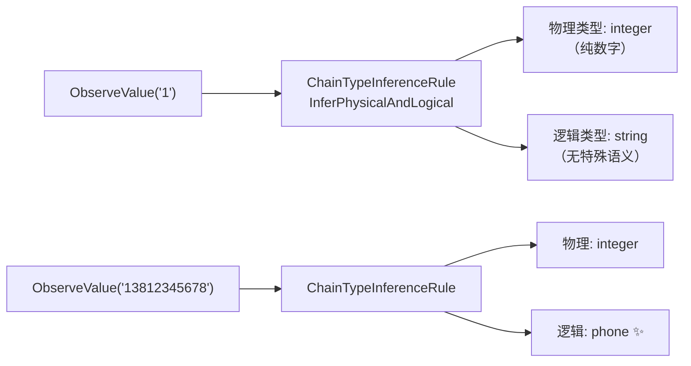

# 查询参数处理

> URL 里的 `?page=1&size=10` 怎么进树？这一页讲大小写、多值、类型推断。

## 参数规范化

源码：[`UrlParser.Parse` (url_parser.go:16-55)](https://github.com/cyberspacesec/reverse-router-tree-skills/blob/main/pkg/request/url_parser.go#L16-L55) · [`normalizePathSegment` (url_parser.go:62)](https://github.com/cyberspacesec/reverse-router-tree-skills/blob/main/pkg/request/url_parser.go#L62)

`UrlParser.Parse()` 对参数做三件事：

```
原始: /list?Page=1&tag=go&tag=web&TAG=py
        │
        ▼
① 参数名小写:   Page→page, TAG→tag
② 多值展开:     tag 出现 3 次 → 3 个 HttpParam
③ URL 解码:     name=%E5%BC%A0%E4%B8%89 → name=张三

结果 params:
  [{page, 1}, {tag, go}, {tag, web}, {tag, py}]
```

## 进树后

```
list
 └─ GET
      ├─ page [Param]          ← 名小写，只一个节点
      └─ tag  [Param]          ← 3 个值合并到同一节点，multi_value=true
```

### 大小写不敏感

HTTP 参数名大小写不敏感是约定（`Page`/`page`/`PAGE` 是同一个参数）。在 `UrlParser.Parse()` 和 `RequestParamNode` 构造函数里统一转小写，`IsMatch()` 用 `EqualFold` 匹配：

```
请求1: /list?Page=1     → 参数名 page，值 1
请求2: /list?page=2     → 同一 page 节点，观察值 2
请求3: /list?PAGE=3     → 同一 page 节点，观察值 3
```

### 多值参数

源码：`findOrCreateParamNode` 在 [`reverse_router.go:767`](https://github.com/cyberspacesec/reverse-router-tree-skills/blob/main/pkg/router/reverse_router.go#L767) 附近；`IsMultiValue` / `SetMultiValue` 标记在 [`request_param_node.go:194-206`](https://github.com/cyberspacesec/reverse-router-tree-skills/blob/main/pkg/node/request_param_node.go#L194-L206)

同一参数名出现多次（`?tag=go&tag=web`）：

```
UrlParser 展开: [{tag,go}, {tag,web}]
        │
        ▼
findOrCreateParamNode:
  第 1 次 → 创建 tag 节点，ObserveValue("go")
  第 2 次 → 找到 tag 节点，ObserveValue("web")
        │
        ▼
tag [Param, multi_value=true]
  ValueMetric: {go:1, web:1}
  ExtractValue() 提取所有值
```

## 类型推断

源码：`RequestParamNode` 构造与值观察在 [`request_param_node.go:42-63`](https://github.com/cyberspacesec/reverse-router-tree-skills/blob/main/pkg/node/request_param_node.go#L42-L63)，推断由 `ChainTypeInferenceRule` 触发（见 [类型推断体系](/architecture/type-inference)）。

参数节点创建时和每次观察新值时自动推断物理+逻辑类型：



```
GET /api/users?page=1
        │
        ▼ findOrCreateParamNode
page [Param]
  ObserveValue("1")
  ChainTypeInferenceRule.InferPhysicalAndLogical()
        │
        ├─ 物理类型: integer（纯数字）
        └─ 逻辑类型: string（无特殊语义）

GET /api/users?page=2  → 观察值 "2"，重新推断，仍 integer
GET /api/sms?phone=13812345678
  phone [Param]
        ├─ 物理类型: integer
        └─ 逻辑类型: phone ✨  ← 识别为手机号
```

详见 [类型推断体系](/architecture/type-inference)。

## 出现计数（presenceCount）

源码：`IncrementPresenceCount` 在 [`request_param_node.go:145`](https://github.com/cyberspacesec/reverse-router-tree-skills/blob/main/pkg/node/request_param_node.go#L145) 用 `atomic.AddInt64`；`GetPresenceCount` 在 [`request_param_node.go:150`](https://github.com/cyberspacesec/reverse-router-tree-skills/blob/main/pkg/node/request_param_node.go#L150) 用 `atomic.LoadInt64`。

每次参数出现（不管值变没变），`presenceCount` 原子加 1。这是 [必需参数推断](/features/required-params) 的依据：

```
GET /api/users?page=1            page 出现, presenceCount=1
GET /api/users?page=2&size=10    page+size 出现
GET /api/users?page=3&size=20    page+size 出现
...（共 10 次，page 必现，size 出现 6 次，callback 出现 2 次）

InferRequiredParams:
  page:     10/10 = 1.0 ≥ 0.9 → 必需   (显示 page*)
  size:      6/10 = 0.6 < 0.9 → 可选
  callback:  2/10 = 0.2 < 0.9 → 可选
```

## 与 body 参数合并

POST/PUT/PATCH 的请求体参数（由 [BodyParser](/features/body-parser) 解析）会和查询参数合并成 `allParams`，统一进入第 ⑥ 步处理，享受同样的类型推断、多值、必需性推断能力：

```
POST /api/users?page=1  (body: name=alice&age=30)

allParams = [page, name, age]   ← 查询 + body 合并

users
 └─ POST
      ├─ page [Param]
      ├─ name [Param]
      └─ age  [Param]
```

## 下一步

- body 参数怎么解析 → [请求体解析](/features/body-parser)
- 必需性怎么判定 → [必需参数推断](/features/required-params)
