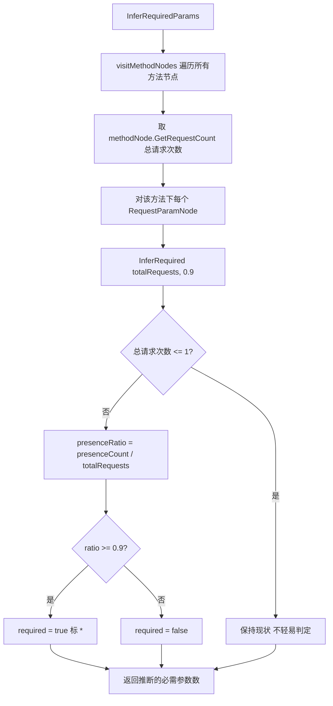

# 必需参数推断

> 黑盒场景下不知道参数是不是必需的。靠**出现频率**推断。

## 问题

白盒（看后端代码）一眼知道 `page` 是必需还是可选。黑盒只能看流量：这个参数在请求里出现得多频繁？

```
GET /api/users?page=1                 page 出现
GET /api/users?page=2&size=10         page, size 出现
GET /api/users?page=3&size=20         page, size 出现
GET /api/users?page=4&size=30&callback=x  page, size, callback 出现
...（共 10 次：page 必现，size 出现 6 次，callback 出现 2 次）
```

`page` 几乎每次都出现 → 很可能是必需；`callback` 偶尔出现 → 可选。

## 推断算法

```go
func (x *ReverseRouter) InferRequiredParams() int
```

源码：[`InferRequiredParams` (reverse_router.go:841-874)](https://github.com/cyberspacesec/reverse-router-tree-skills/blob/main/pkg/router/reverse_router.go#L841-L874) · [`InferRequired` (request_param_node.go:170-181)](https://github.com/cyberspacesec/reverse-router-tree-skills/blob/main/pkg/node/request_param_node.go#L170-L181)



```
对每个方法节点下的每个参数节点:
  出现率 = presenceCount / 方法节点请求次数

  出现率 ≥ RequiredParamThreshold (默认 0.9) → 必需   (标 *)
  出现率 <  阈值                              → 可选
  样本不足 (总请求次数 ≤ 1)                   → 保持默认（不轻易判定）
```

`presenceCount` 在 [`findOrCreateParamNode` (reverse_router.go:767)](https://github.com/cyberspacesec/reverse-router-tree-skills/blob/main/pkg/router/reverse_router.go#L767) 里每次参数出现用 `atomic.AddInt64` 累加，[`GetPresenceCount` (request_param_node.go:146)](https://github.com/cyberspacesec/reverse-router-tree-skills/blob/main/pkg/node/request_param_node.go#L146) 用 `atomic.LoadInt64` 读取——线程安全。

## 例子

```
共 10 次请求 /api/users GET:
  page:     10/10 = 1.0  ≥ 0.9 → 必需   显示为 page*
  size:      6/10 = 0.6  < 0.9 → 可选   显示为 size
  callback:  2/10 = 0.2  < 0.9 → 可选   显示为 callback
```

## 样本不足保护

只有 1 次请求时，参数出现率必然是 0 或 1，据此判定必需太武断：

```
GET /api/users?page=1   （只抓到 1 次）

page: 1/1 = 1.0
  └─ 但样本量 ≤ 1，保持默认（不判定必需）
```

`总请求次数 ≤ 1` 时保持默认，避免单次样本误判。**样本越多越准**——所以建议在路由树构建完成、导出前调用。

## 树形输出标记

必需参数在 `Tree.String()` 里带 `*` 后缀：

```
GET
 ├─ page* [Param]      ← 必需
 ├─ size  [Param]      ← 可选
 └─ callback [Param]
```

## 配置阈值

```go
r.SetMergeConfig(router.MergeConfig{
	RequiredParamThreshold: 0.95,  // 更严格，要 95% 出现率才判必需
})
```

## 与 OpenAPI 导出

`InferRequiredParams()` 后再导出 OpenAPI，必需参数会标 `required: true`：

```json
{
  "name": "page",
  "in": "query",
  "required": true,        ← 推断结果
  "schema": { "type": "integer" }
}
```

路径变量恒为 `required: true`（路径变量必填），不受此推断影响。

## 使用时机

```go
// 1. 喂完所有请求
for _, req := range requests {
	r.ReverseHttpRequest(req)
}

// 2. 推断必需性（样本最全）
r.InferRequiredParams()

// 3. 导出
exporter.NewOpenAPIExporter().Export(r.Tree)
```

## 下一步

- 参数计数怎么累加 → [查询参数处理](/features/query-params)
- 导出怎么用必需性 → [OpenAPI 导出](/features/openapi-export)
