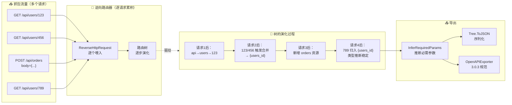
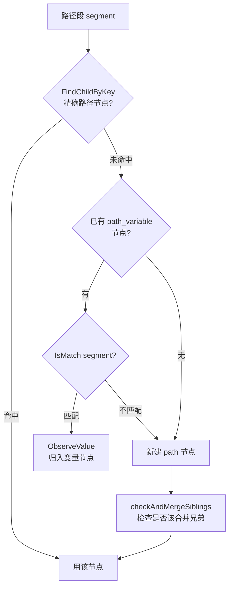
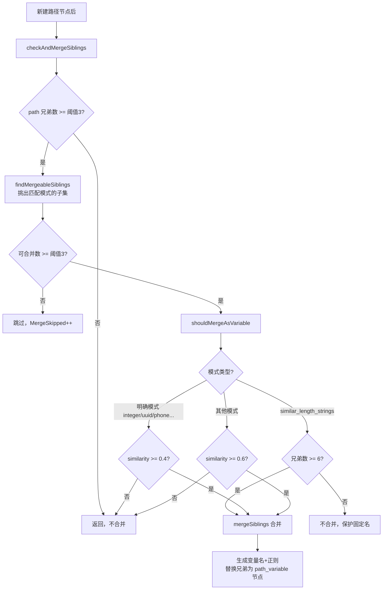
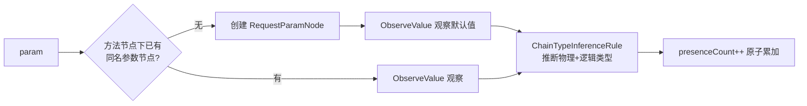

# 9 步逆向流程

> `ReverseHttpRequest()` 是整个项目的核心方法：把一个 HTTP 请求逆向工程进路由树。它分 9 步。


## 从抓包到路由树：端到端全链路

单个请求的 9 步只是瞬间动作。真实场景下，工具接收的是**一批抓包流量**，逐个喂入后路由树逐步演化，最终导出为 OpenAPI 规范供上层项目消费。



关键点：
- **逐请求累积**：每个请求只做增量更新（建节点/合并变量/累加计数），不重算整棵树
- **合并是延迟触发的**：同层兄弟达到阈值（默认 3）才合并，所以请求顺序影响中间状态，但最终态对顺序不敏感
- **类型推断分两层**：物理类型（integer/string）由 `PhysicalTypeInferenceRule` 定，逻辑类型（uuid/phone/idcard）由 `LogicalTypeInferenceRule` 定，链式规则 `InferPhysicalAndLogical` 分别回填——**绝不混用单一 Infer**，否则逻辑串会污染物理字段（曾有 bug：uuid 物理类型被覆盖成 `"uuid"`）
- **必需性最后推断**：所有请求喂完后调一次 `InferRequiredParams`，基于出现频率（阈值 0.9）

## 总览（带技术细节）

```
ReverseHttpRequest(request)
 │
 ①  URL 解析              UrlParser.Parse() → paths + params
 ②  路径匹配/创建         尾部斜杠、URL 解码、逐段找/建节点
 ③  路径参数识别          key=value 格式路径段
 ④  路径变量识别合并      选择性合并，固定路径保留        ← 核心难点
 ⑤  HTTP 方法节点        GET/POST/...
 ⑥  查询+body 参数节点   合并、大小写不敏感、类型推断
 ⑦  Content-Type 节点    POST/PUT/PATCH
 ⑧  Header 路由节点      两层：名称 → 值
 ⑨  Cookie 路由节点      两层：名称 → 值
 │
 ▼
路由树更新（副作用：建节点、合并变量、累加计数、触发类型推断）
```

## 第 ① 步：解析 URL

源码：[`pkg/request/url_parser.go`](https://github.com/cyberspacesec/reverse-router-tree-skills/blob/main/pkg/request/url_parser.go) · 调用点 [`reverse_router.go:153-159`](https://github.com/cyberspacesec/reverse-router-tree-skills/blob/main/pkg/router/reverse_router.go#L153-L159)

```go
urlParser := request.NewUrlParser(req.Url)
paths, params, err := urlParser.Parse()
```

把 URL 拆成有序路径段 + 参数列表：

```
/api/users/123?page=1&tag=go&tag=web&Page=2
        │
        ▼  UrlParser.Parse()
paths:  ["api", "users", "123"]              ← URL 解码、过滤 ./.. 、去尾部斜杠
params: [{name:"page", value:"1"},           ← 参数名小写（Page→page, page 合并）
         {name:"tag",  value:"go"},           ← 多值展开成多条
         {name:"tag",  value:"web"},
         {name:"page", value:"2"}]
```

`Parse()` 内部依次做：`Trim(path,"/")` 去尾部斜杠 → 循环替换 `//`→`/` → 逐段 `url.PathUnescape()` 解码 → `normalizePathSegment` 过滤 `.`/`..` → 参数名 `ToLower` → 多值参数展开。

## 第 ② 步：路径匹配/创建

源码：[`findOrCreatePathNode` (reverse_router.go:262-293)](https://github.com/cyberspacesec/reverse-router-tree-skills/blob/main/pkg/router/reverse_router.go#L262-L293)

逐段在树里找，**三段式匹配**：精确路径 → 路径变量 `IsMatch` → 新建节点。



注意 `IsMatch` 的双行为（[`request_path_variable_node.go`](https://github.com/cyberspacesec/reverse-router-tree-skills/blob/main/pkg/node/request_path_variable_node.go)）：**有模式正则时严格匹配**（`123` 匹配 `[0-9]+`），**无模式时启发式**（数字/UUID 等可变特征）。这让已有变量节点能吸收同模式的新值，而不匹配的值（`special`）会落到下面新建节点 → 触发软回退。

## 第 ③ 步：路径参数识别

源码：[`pkg/request/http_request_path.go`](https://github.com/cyberspacesec/reverse-router-tree-skills/blob/main/pkg/request/http_request_path.go) · 集成点 [`reverse_router.go:164-185`](https://github.com/cyberspacesec/reverse-router-tree-skills/blob/main/pkg/router/reverse_router.go#L164-L185)

某些路径段里直接嵌了 `key=value`（如 Spring 的路径参数）：

```
/api/action=delete
/api/action=create
        │
        ▼
识别 action 是路径参数（非路径段），提取为参数
合法参数名：字母/下划线开头
```

实现细节：`IsPathParam()` 检测 `key=value` 格式，合法参数名校验后，参数键名仍作为路径节点存在（保证树形结构完整），值收集进 `pathParams`，第⑤步和查询参数合并处理。

## 第 ④ 步：路径变量识别合并（核心难点）

当一个父节点下有**多个同层兄弟**，可能要合并成变量：

```
触发条件：兄弟节点数 >= SiblingMergeThreshold（默认 3，即 3 个就尝试）
         且模式匹配达到阈值（明确模式 ≥0.4，其他 ≥0.6）

合并前:                          合并后:
users                            users
 ├─ list                          ├─ list [保留]          ← 固定路径
 ├─ create                        ├─ create [保留]        ← 固定路径
 ├─ 101                           └─ {users_id} [Var]     ← 合并的变量
 ├─ 102                                type: integer
 └─ 103                                pattern: [0-9]+
```

**选择性合并策略**（详见 [选择性合并](/features/selective-merge)）：

| 模式类型 | 合并阈值 | 行为 |
|----------|----------|------|
| 明确结构化模式（integer/uuid/phone…） | ≥ 0.4 | 合并匹配的，固定路径保留 |
| 其他模式 | ≥ 0.6 | 合并 |
| `similar_length_strings` | 默认不合并，≥6 个突破 | 保护固定路径名 |
| 都不满足 | — | 不合并 |

合并的完整决策链在 [`shouldMergeAsVariable` (reverse_router.go:492-538)](https://github.com/cyberspacesec/reverse-router-tree-skills/blob/main/pkg/router/reverse_router.go#L492-L538)，触发入口是 [`checkAndMergeSiblings` (reverse_router.go:296-321)](https://github.com/cyberspacesec/reverse-router-tree-skills/blob/main/pkg/router/reverse_router.go#L296-L321)：



还有两种特殊合并：[前缀/后缀合并](/features/prefix-suffix-merge)（`user_001`→`{user_id}`）和[相似串突破](/features/similar-strings)（6+ 城市名）。

## 第 ⑤ 步：HTTP 方法节点

源码：[`findOrCreateMethodNode` (reverse_router.go:741-754)](https://github.com/cyberspacesec/reverse-router-tree-skills/blob/main/pkg/router/reverse_router.go#L741-L754) · 调用点 [`reverse_router.go:187-196`](https://github.com/cyberspacesec/reverse-router-tree-skills/blob/main/pkg/router/reverse_router.go#L187-L196)

```
users
 ├─ GET     ← 创建方法节点
 └─ POST
```

方法名统一 `ToUpper`，空方法默认 `GET`。方法节点是路径与参数之间的**分界层**——同一个路径下多方法各自独立挂参数。

## 第 ⑥ 步：查询 + body 参数节点

源码：[`processParams` (reverse_router.go:756-765)](https://github.com/cyberspacesec/reverse-router-tree-skills/blob/main/pkg/router/reverse_router.go#L756-L765) · [`findOrCreateParamNode` (reverse_router.go:767-816)](https://github.com/cyberspacesec/reverse-router-tree-skills/blob/main/pkg/router/reverse_router.go#L767-L816) · [`pkg/request/body_parser.go`](https://github.com/cyberspacesec/reverse-router-tree-skills/blob/main/pkg/request/body_parser.go)

参数有三个来源，合并后统一处理：

```
POST /api/users?page=1  (body: name=alice&age=30)

allParams = URL查询参数 + 路径嵌入参数 + body参数
         = [page, name, age]

users
 └─ POST
      ├─ page [Param, integer]      ← 查询参数
      ├─ name [Param]               ← body 参数
      └─ age  [Param]
```

`findOrCreateParamNode` 内部逻辑：



处理细节：
- **大小写不敏感**：`Page`/`page` 合并（`EqualFold` 匹配）
- **多值**：`?tag=go&tag=web` 合并到同一节点，`multi_value=true`
- **类型推断**：观察值后自动推断物理+逻辑类型（[`pkg/inference/`](https://github.com/cyberspacesec/reverse-router-tree-skills/blob/main/pkg/inference/chain_type_inference_rule.go)）
- **出现计数**：`presenceCount++`（atomic），供 [必需参数推断](/features/required-params) 用

JSON body 嵌套会扁平化：

```
body: {"user":{"name":"bob"},"tags":["vip"]}
        │  BodyParser
        ▼
POST
 ├─ user.name [Param]      ← 嵌套用点号
 └─ tags.0   [Param]       ← 数组用索引
```

详见 [请求体解析](/features/body-parser)。

## 第 ⑦ 步：Content-Type 节点

源码：[`findOrCreateContentTypeNode` (reverse_router.go:818-839)](https://github.com/cyberspacesec/reverse-router-tree-skills/blob/main/pkg/router/reverse_router.go#L818-L839) · 调用点 [`reverse_router.go:224-231`](https://github.com/cyberspacesec/reverse-router-tree-skills/blob/main/pkg/router/reverse_router.go#L224-L231)

仅 POST/PUT/PATCH 创建：

```
POST /api/users (Content-Type: application/json)

users
 └─ POST
      └─ application/json [ContentType]    ← 作为子路由维度
```

Content-Type 取自主类型（`application/json; charset=utf-8` → `application/json`）。同一方法下，JSON 和表单进不同 CT 子节点——它们通常是不同的处理逻辑。

## 第 ⑧ 步：Header 路由节点

源码：`processRoutingHeaders` · [`pkg/router/reverse_router.go`](https://github.com/cyberspacesec/reverse-router-tree-skills/blob/main/pkg/router/reverse_router.go)

```
GET /api/data (Accept: application/json)
GET /api/data (Accept: text/html)

data
 └─ GET
      └─ Accept [Header]
           ├─ application/json [HeaderValue]    ← 值已规范化
           └─ text/html [HeaderValue]
```

支持的路由 Header：`Accept`/`Authorization`/`X-Api-Version`/`Accept-Language`/`X-Requested-With`，值会规范化（如 `Authorization: Bearer token123` → `Bearer`）。详见 [Header 路由](/features/header-routing)。

## 第 ⑨ 步：Cookie 路由节点 & 请求计数

源码：`processCookies` · 计数 [`reverse_router.go:247-252`](https://github.com/cyberspacesec/reverse-router-tree-skills/blob/main/pkg/router/reverse_router.go#L247-L252)

```
GET /api/home (Cookie: lang=zh-CN)
GET /api/home (Cookie: lang=en-US)

home
 └─ GET
      └─ lang [Cookie]
           ├─ zh-CN [CookieValue]
           └─ en-US [CookieValue]
```

每个 Cookie 名=值都作为路由维度。最后两步收尾：`currentNode.IncrementRequestCount()` + `methodNode.IncrementRequestCount()` 累加请求计数，`stats.RequestsProcessed.Add(1)` 计数，Debug 日志输出完成。详见 [Cookie 路由](/features/cookie-routing)。

## 副作用清单

调用一次 `ReverseHttpRequest`（[源码 reverse_router.go:144-255](https://github.com/cyberspacesec/reverse-router-tree-skills/blob/main/pkg/router/reverse_router.go#L144-L255)），可能：

- ✅ 在树里创建新节点（路径/方法/参数/CT/Header/Cookie）
- ✅ 合并相似路径为路径变量节点（`mergeSiblings`）
- ✅ 累加路径节点和方法节点的请求计数
- ✅ 触发参数/路径变量的类型推断（`ChainTypeInferenceRule`）
- ✅ 累加参数的 `presenceCount`（atomic）
- ✅ 输出结构化日志、更新 11 项统计指标

## 下一步

- 第④步详细 → [路径变量识别](/features/path-variable) + [选择性合并](/features/selective-merge)
- 反向问题：还要不要请求 → [IsNeedRequest 去重](/features/is-need-request)
