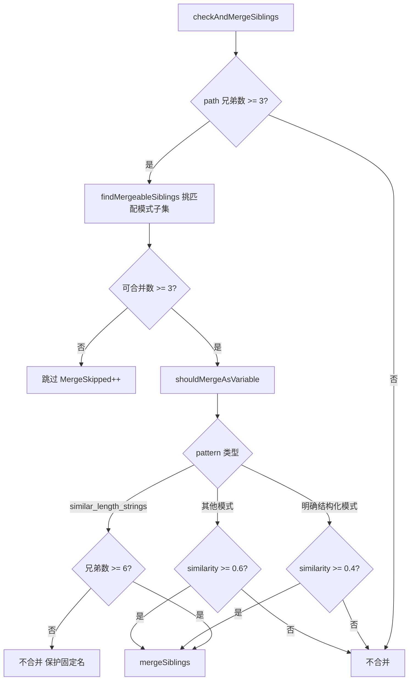
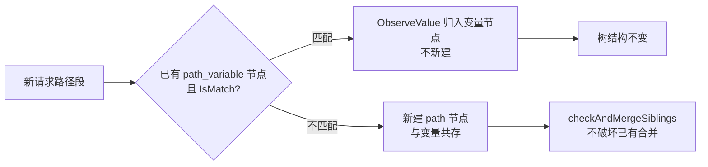

# 选择性合并策略

> 最容易踩的坑：把固定路径名误合并进变量。选择性合并就是解决这个的。


## 误合并的灾难

如果没有选择性合并，看到 5 个兄弟（`list`/`create`/`101`/`102`/`103`）就全塞进变量——`list`/`create` 会被当成变量值吞掉，真实接口消失，攻击面严重失真。它们和 `101`/`102`/`103` 模式不同，必须区别对待。

## 选择性合并：只合并符合模式的子集

```
5 个兄弟：list, create, 101, 102, 103
        │
        ▼ PatternDetector
对每个值检测模式：
  list   → 不匹配 integer（也不是其他模式）
  create → 不匹配
  101    → integer ✅
  102    → integer ✅
  103    → integer ✅

整体匹配率 = 3/5 = 0.6
integer 是明确结构化模式，阈值降到 0.4 → 0.6 ≥ 0.4，合并匹配的子集
        │
        ▼
users
 ├─ list    [Path]            ← 不匹配，保留为固定路径
 ├─ create  [Path]            ← 不匹配，保留
 └─ {users_id} [Var]          ← 只合并 101/102/103
```

## 合并判定逻辑

源码：[`shouldMergeAsVariable` (reverse_router.go:492-538)](https://github.com/cyberspacesec/reverse-router-tree-skills/blob/main/pkg/router/reverse_router.go#L492-L538) · [`checkAndMergeSiblings` (reverse_router.go:296-321)](https://github.com/cyberspacesec/reverse-router-tree-skills/blob/main/pkg/router/reverse_router.go#L296-L321) · [`findMergeableSiblings` (reverse_router.go:326-372)](https://github.com/cyberspacesec/reverse-router-tree-skills/blob/main/pkg/router/reverse_router.go#L326-L372)

判定是**逐个兄弟**进行的（`shouldMergeAsVariable`），不是简单按整体匹配率分档。核心规则：

```
对一组兄弟节点，PatternDetector.DetectPattern(values) → (patternName, similarity)

① similar_length_strings（长度相似但无结构化模式）
   ├─ 兄弟数 >= SimilarLengthBreakThreshold(默认6) → 合并（突破）
   └─ 否则 → 不合并（保护 admin/manager/guest 这类固定路径名）

② 明确结构化模式（integer/uuid/float/version/alphanumeric/
   phone/idcard/bankcard/plate）
   └─ similarity >= 0.4 即合并（降阈，因为数字/UUID/手机号几乎肯定是变量）

③ 其他模式
   └─ similarity >= PatternSimilarityThreshold(默认0.6) 才合并

④ 都不满足 → 不合并
```

完整决策流：



简化成匹配率分档便于理解：

| 模式类型 | 合并阈值 | 含义 |
|----------|----------|------|
| 明确结构化模式（数字/UUID/手机号…） | ≥ 0.4 | 几乎不可能是固定路径，降阈放宽 |
| 其他模式 | ≥ 0.6（`PatternSimilarityThreshold`） | 需要更高把握 |
| `similar_length_strings` | 默认不合并，≥6 个才突破 | 保护固定路由名 |

阈值由 `MergeConfig.PatternSimilarityThreshold`（默认 0.6）和 `SimilarLengthBreakThreshold`（默认 6）控制，定义见 [`MergeConfig` (reverse_router.go:16-46)](https://github.com/cyberspacesec/reverse-router-tree-skills/blob/main/pkg/router/reverse_router.go#L16-L46)。

::: tip 为什么明确模式降阈到 0.4
`integer`/`uuid`/`phone`/`idcard` 这些有明确结构的模式，固定路径名几乎不可能命中（路由名不会是 18 位身份证号）。所以即使只有 40% 兄弟匹配，也敢合并——匹配的那些几乎肯定是变量值。这是"宁可漏合并固定路径，不可放过变量值"的偏保守策略。
:::

## 为什么 similar_length_strings 默认不合并

有一类模式叫 `similar_length_strings`——长度相似但无结构化模式（不像纯数字/UUID 有明确格式）：

```
/api/roles/admin    ┐
/api/roles/manager  ├─ 长度相似(5-6)，但都是固定角色名
/api/roles/guest    ┘   不该合并！
```

`admin`/`manager`/`guest` 是固定路由名，强行合并会把真实功能藏起来。所以 `similar_length_strings` **默认永不合并**，保护这类固定路径名。

但当兄弟数 ≥ 6 时会突破此规则（见 [相似串合并突破](/features/similar-strings)）——因为固定路由名很少超过 5 个同层，大量相似串更可能是变量值集合（城市名、人名）。

## 共存式软回退

源码：变量节点匹配逻辑在 [`findOrCreatePathNode` (reverse_router.go:273-281)](https://github.com/cyberspacesec/reverse-router-tree-skills/blob/main/pkg/router/reverse_router.go#L273-L281) · [`RequestPathVariableNode.IsMatch`](https://github.com/cyberspacesec/reverse-router-tree-skills/blob/main/pkg/node/request_path_variable_node.go)

变量节点建立后，来了一个不匹配的新值怎么办？



```
已有: {users_id} [Var, integer], pattern=[0-9]+

新请求 /api/users/special   ← "special" 不匹配 [0-9]+
        │
        ▼
不破坏已有合并！special 作为固定路径与变量节点共存:
users
 ├─ {users_id} [Var]    ← 保留
 └─ special   [Path]    ← 新增固定路径

再来 /api/users/205     ← 205 匹配 [0-9]+
        │
        ▼
正确归入变量节点（不新建）:
users
 ├─ {users_id} [Var]    ← 205 归入这里
 └─ special   [Path]
```

这叫**共存式软回退**：不符合模式的新值当固定路径共存，符合的仍归入变量。不破坏已有合并，覆盖现实业务绝大多数情况。固定路径与变量可同层共存（如 `{users_id}` + `list` + `create`）。

::: warning 为什么不实现"硬回退"
硬回退指"拆分已合并的变量节点"。它需要保留全部原始值历史、重做模式检测，风险高且触发场景罕见（要先大量数字合并、后证明全是固定路径的极端顺序）。属过度工程，故不实现。需要时可考虑：保留原始值统计 + 固定路径占比超阈值时拆分。
:::

## 配置

```go
r.SetMergeConfig(router.MergeConfig{
	SiblingMergeThreshold:       3,   // 同层 ≥3 个兄弟才尝试合并
	PatternSimilarityThreshold:  0.6, // 匹配率 ≥0.6 才合并
	SimilarLengthBreakThreshold: 6,   // 相似串 ≥6 个才突破
	RequiredParamThreshold:      0.9,
})
```

## 下一步

- 相似串突破 → [相似串合并突破](/features/similar-strings)
- user_001 模式 → [前缀/后缀合并](/features/prefix-suffix-merge)
