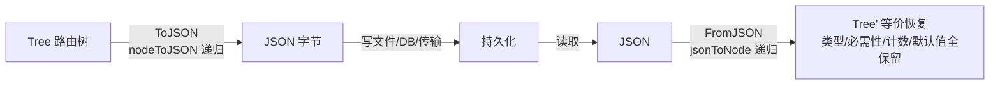

# 路由树序列化

> `ToJSON()` / `FromJSON()` 完整保留类型信息，往返一致，可持久化路由树状态。

## 为什么序列化

逆向一棵路由树可能要处理成千上万请求，耗时。序列化后可以：

- **持久化**：把树存文件/DB，下次直接 `FromJSON` 恢复，不重新喂数据
- **传输**：多节点协同测绘时，把树传给别人合并
- **快照**：不同时刻的树对比，看路由变化

## 保留的信息

```
路径变量节点:
  ├─ inferred_type     物理类型
  ├─ logical_type      逻辑类型
  └─ pattern           模式正则

参数节点:
  ├─ required          是否必需
  ├─ physical_type     物理类型
  ├─ logical_type      逻辑类型
  ├─ presence_count    出现次数
  ├─ default_value     默认值
  └─ multi_value       多值标记

Header/Cookie 节点:
  └─ 两层结构完整保留
```

## 往返一致

源码：[`ToJSON` (tree.go:229-233)](https://github.com/cyberspacesec/reverse-router-tree-skills/blob/main/pkg/tree/tree.go#L229-L233) · 递归导出 [`nodeToJSON` (tree.go:235-277)](https://github.com/cyberspacesec/reverse-router-tree-skills/blob/main/pkg/tree/tree.go#L235-L277) · 导入 [`FromJSON` (tree.go:282-290)](https://github.com/cyberspacesec/reverse-router-tree-skills/blob/main/pkg/tree/tree.go#L282-L290) · 递归恢复 [`jsonToNode` (tree.go:293-387)](https://github.com/cyberspacesec/reverse-router-tree-skills/blob/main/pkg/tree/tree.go#L293-L387)

> 路径变量的 `pattern`（合并时推断出的正则）一并参与往返——反序列化后 `IsMatch` 仍按原正则严格匹配，不会退化为启发式。



## API

```go
// 导出
data, err := r.Tree.ToJSON()
// data 是 JSON 字节，可写文件

// 导入
t := tree.NewTree()
err := t.FromJSON(data)
// t 恢复了完整路由树
```

## 与 OpenAPI 导出的区别

| 序列化 `ToJSON` | OpenAPI 导出 `Export` |
|------------------|----------------------|
| **内部格式**，保留全部实现细节 | **标准规范**，给外部工具看 |
| 含 presence_count、multi_value 等内部字段 | 只输出 OpenAPI 规范字段 |
| 往返一致，可 `FromJSON` 恢复 | 不可逆（丢了内部统计） |
| 用于持久化、恢复、内部传输 | 用于 Swagger UI / Redoc 渲染 |

简单说：`ToJSON` 是给**自己**看的（机器恢复），`Export` 是给**别人**看的（标准文档）。

## 下一步

- 标准规范导出 → [OpenAPI 导出](/features/openapi-export)
- 树结构 → [路由树结构](/architecture/tree-structure)
