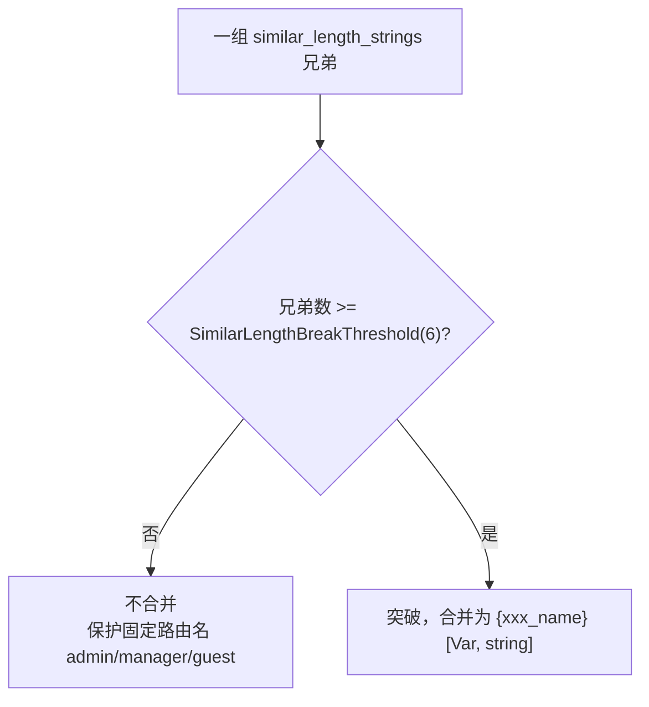

# 相似串合并突破

> `similar_length_strings` 模式默认不合并（保护 `admin`/`manager`/`guest`）；但当数量够多（≥6），就突破规则合并。

## 矛盾

固定路由名和变量值集合都可能是“长度相似的字符串”：

```
情况 A（固定路由名，不该合并）:     情况 B（变量值集合，该合并）:
/api/roles/admin                  /api/city/北京
/api/roles/manager                /api/city/上海
/api/roles/guest                  /api/city/广州
                                  /api/city/深圳
                                  /api/city/杭州
                                  /api/city/成都
```

两者都没有结构化模式（不像数字/UUID），光看长度无法区分。默认“不合并”保护了 A，但漏掉了 B。

## 突破规则：数量信号

源码：`similar_length_strings` 判定在 [`shouldMergeAsVariable` (reverse_router.go:492-537)](https://github.com/cyberspacesec/reverse-router-tree-skills/blob/main/pkg/router/reverse_router.go#L492-L537)，与 `SimilarLengthBreakThreshold`（默认 6）比较；阈值定义在 [`MergeConfig` (reverse_router.go:16-46)](https://github.com/cyberspacesec/reverse-router-tree-skills/blob/main/pkg/router/reverse_router.go#L16-L46)。



**洞察**：固定路由名很少有 6 个以上同层兄弟；大量同层相似串强烈暗示是变量值集合（城市名、人名、商品名）。

```
兄弟数 < 6  → 不合并（保守，保护固定路径名）
兄弟数 ≥ 6  → 突破，合并为变量
```

阈值 `SimilarLengthBreakThreshold` 默认 6，可通过 `MergeConfig` 配置，设 0 禁用此突破规则（回到“永不合并”的旧行为）。

## 例子

```
情况 A: roles 下 admin/manager/guest（3个 < 6）
   → 不合并，保留为固定路径 ✅

roles [Path]
 ├─ admin   [Path]
 ├─ manager [Path]
 └─ guest   [Path]


情况 B: city 下 6 个城市名（≥ 6）
   → 突破合并 ✅

city [Path]
 └─ {city_name} [Var, string]    ← 6 个城市名合并成变量
```

## 为什么是 6 这个数

固定路由名超过 5 个同层的很少见——一个资源下的 CRUD 通常是 list/create/detail/update/delete 这类，个位数。而变量值集合（枚举类）动辄几十上百。

6 是经验阈值：高到能挡住固定路由名，低到能抓住变量值集合。可根据业务调整。

## 配置

```go
// 调整突破阈值
r.SetMergeConfig(router.MergeConfig{
	SimilarLengthBreakThreshold: 10,  // 更保守，要 10 个才突破
})

// 或禁用突破（similar_length_strings 永不合并）
r.SetMergeConfig(router.MergeConfig{
	SimilarLengthBreakThreshold: 0,
})
```

## 与其他合并的关系

```
检测顺序（DetectPattern 内）:
1. 结构化模式（integer/uuid/phone/...）  ← 优先
2. 前缀/后缀模式                          ← 结构化不足时回退
3. similar_length_strings                 ← 最后
   ├─ 兄弟数 < 阈值 → 不合并
   └─ 兄弟数 ≥ 阈值 → 突破合并
```

## 下一步

- 结构化模式合并 → [路径变量识别](/features/path-variable)
- 前缀/后缀合并 → [前缀/后缀合并](/features/prefix-suffix-merge)
