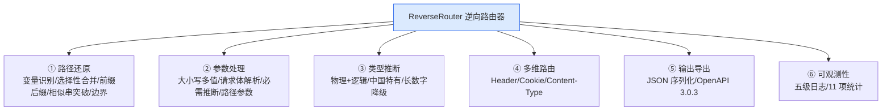

# 它能做什么

本项目能做的事，按能力域分成 6 块。每块都对应文档站里的原理详解。

## 能力总览



## ① 路径还原

| 能力 | 说明 | 详见 |
|------|------|------|
| 路径变量识别 | `/api/users/123` → `/api/users/{id}` | [路径变量识别](/features/path-variable) |
| 选择性合并 | 只合并符合模式的子集，固定路径 `list`/`create` 保留 | [选择性合并](/features/selective-merge) |
| 前缀/后缀合并 | `user_001`/`user_002` → `{user_id}`，生成精确正则 | [前缀/后缀合并](/features/prefix-suffix-merge) |
| 相似串突破 | 6+ 个城市名/人名合并为变量 | [相似串合并](/features/similar-strings) |
| 边界处理 | 尾部斜杠、URL 编码、路径遍历、文件扩展名 | [路径边界条件](/features/path-edge-cases) |

## ② 参数处理

| 能力 | 说明 | 详见 |
|------|------|------|
| 查询参数 | 大小写不敏感（`Page`=`page`）、多值（`?tag=a&tag=b`）、类型推断 | [查询参数处理](/features/query-params) |
| 请求体解析 | 表单 / JSON / multipart 按 Content-Type 分发，JSON 嵌套点号扁平化 | [请求体解析](/features/body-parser) |
| 必需参数推断 | 出现率 ≥ 0.9 判定必需，标 `page*` | [必需参数推断](/features/required-params) |
| 路径参数 | `/api/action=delete` 识别为参数 | [路径边界条件](/features/path-edge-cases) |

## ③ 类型推断

```
Value
 ├── PhysicalType（物理类型）        LogicalType（逻辑类型）
 │   string / integer / float        │   date / time / datetime / email
 │   boolean / array / object / null │   url / uuid / json / xml / ipaddress
 │                                   │   decimal / currency / percentage
 │                                   │   phone / idcard / bankcard / plate  ← 中国特有
```

| 能力 | 说明 | 详见 |
|------|------|------|
| 物理类型 | 统计各类型匹配次数选最多的；长数字串降级 string | [类型推断体系](/architecture/type-inference) |
| 逻辑类型 | 模式匹配 + 枚举检测；电话号码归一化 | 同上 |
| 中国特有格式 | 手机号/座机号/身份证号/银行卡号/车牌号 | [中国特有格式](/features/china-formats) |
| 长数字串降级 | ≥16 位纯数字 → string（标识符语义，避 int64 溢出） | [长数字串降级](/features/long-number) |

## ④ 多维路由

不只是路径，**任何影响路由决策的维度都进树**：

```
GET /api/data  (Accept: application/json)   ─┐
GET /api/data  (Accept: text/html)          ─┤  Accept 维度分流
                                            ─┘

data
 └─ GET
    └─ Accept [header]
         ├─ application/json
         └─ text/html
```

| 能力 | 支持的 Header | 详见 |
|------|---------------|------|
| Header 路由 | Accept / Authorization / X-Api-Version / Accept-Language / X-Requested-With | [Header 路由](/features/header-routing) |
| Cookie 路由 | 任意 Cookie 名 = 值 | [Cookie 路由](/features/cookie-routing) |
| Content-Type 路由 | POST/PUT/PATCH 的请求体格式 | [请求体解析](/features/body-parser) |

## ⑤ 输出导出

| 能力 | 说明 | 详见 |
|------|------|------|
| 路由树序列化 | `ToJSON`/`FromJSON` 含物理/逻辑类型、必需性、计数，往返一致 | [路由树序列化](/features/serialization) |
| OpenAPI 3.0.3 | 路径变量还原 `{var}`，query/path/header/cookie 四类参数，POST body schema，Swagger UI 直接渲染 | [OpenAPI 导出](/features/openapi-export) |

## ⑥ 可观测性

| 能力 | 说明 | 详见 |
|------|------|------|
| 结构化日志 | 封装 `log/slog`，五级（Debug/Info/Warn/Error/Off），默认 Warn | [日志与统计](/features/observability) |
| 统计指标 | 11 项 atomic 计数：请求数/变量数/合并数/参数数…，支持 JSON | 同上 |

## 当前完成度

| 模块 | 状态 | 覆盖率 |
|------|------|--------|
| node 节点层 | ✅ | 84.2% |
| request 请求层 | ✅ | 92.2% |
| tree 树层 | ✅ | 82.0% |
| router 路由层 | ✅ | 76.5% |
| inference 推断层 | ✅ | 84.8% |
| value 值层 | ✅ | 100% |
| exporter 导出层 | ✅ | 78.4% |

**✅ 项目编译通过，所有测试通过（含竞态检测 `-race`）。**

## 下一步

- 直接跑起来 → [快速上手](./quick-start)
- 看一个完整端到端例子 → [一个完整示例](./full-example)
