# 一个完整示例

> 这一页用一组真实的 HTTP 请求，把项目的全部能力一次跑通，并解释输出每一行的含义。

::: tip 跟着源码读
本示例涉及的核心入口：[`NewReverseRouter` (reverse_router.go:60-71)](https://github.com/cyberspacesec/reverse-router-tree-skills/blob/main/pkg/router/reverse_router.go#L60-L71) · [`ReverseHttpRequest` (reverse_router.go:143-256)](https://github.com/cyberspacesec/reverse-router-tree-skills/blob/main/pkg/router/reverse_router.go#L143-L256) · [`InferRequiredParams` (reverse_router.go:841-874)](https://github.com/cyberspacesec/reverse-router-tree-skills/blob/main/pkg/router/reverse_router.go#L841-L874)。每个能力点的实现原理见对应 [功能详解](/features/reverse-flow)。
:::

## 喂进去的请求

```go
r := router.NewReverseRouter()

// ① 路径变量：123/456/789 是同一个变量
r.ReverseHttpRequest(request.NewHttpRequest("/api/users/123", nil, "GET", nil))
r.ReverseHttpRequest(request.NewHttpRequest("/api/users/456", nil, "GET", nil))
r.ReverseHttpRequest(request.NewHttpRequest("/api/users/789", nil, "GET", nil))

// ② 查询参数：page/size 反复出现
r.ReverseHttpRequest(request.NewHttpRequest("/api/users?page=1&size=10", nil, "GET", nil))
r.ReverseHttpRequest(request.NewHttpRequest("/api/users?page=2&size=20", nil, "GET", nil))

// ③ POST + JSON body
h := request.Headers{}; h.Set("Content-Type", "application/json")
r.ReverseHttpRequest(request.NewHttpRequest("/api/users", h, "POST",
	[]byte(`{"name":"alice","age":30}`)))

// ④ Header 路由：Accept 分流
h2 := request.Headers{}; h2.Set("Accept", "application/json")
r.ReverseHttpRequest(request.NewHttpRequest("/api/data", h2, "GET", nil))
h3 := request.Headers{}; h3.Set("Accept", "text/html")
r.ReverseHttpRequest(request.NewHttpRequest("/api/data", h3, "GET", nil))

// ⑤ Cookie 路由：lang 分流
h4 := request.Headers{}; h4.Set("Cookie", "lang=zh-CN")
r.ReverseHttpRequest(request.NewHttpRequest("/api/home", h4, "GET", nil))
h5 := request.Headers{}; h5.Set("Cookie", "lang=en-US")
r.ReverseHttpRequest(request.NewHttpRequest("/api/home", h5, "GET", nil))

r.InferRequiredParams()
fmt.Println(r.Tree.String())
```

## 端到端数据流

下面这张图把本示例的全部维度一次串起来：5 类输入经 `ReverseHttpRequest` 的 9 步流程还原成路由树，再导出 OpenAPI。

```mermaid
flowchart LR
    subgraph IN["输入：5 个维度的 HTTP 请求"]
        direction TB
        A1["① 路径变量<br/>/api/users/123|456|789"]
        A2["② 查询参数<br/>?page=1&size=10"]
        A3["③ POST + JSON body<br/>name, age"]
        A4["④ Header 路由<br/>Accept: json|html"]
        A5["⑤ Cookie 路由<br/>lang=zh|en"]
    end

    IN --> RR["ReverseHttpRequest<br/>9 步逆向流程<br/>解析→路径→参数→body→CT→header→cookie→计数→合并"]

    RR --> TREE["还原路由树"]

    subgraph TREE["还原路由树"]
        direction TB
        T1["{users_id} Var:integer<br/>← ① 合并"]
        T2["page* size* Param<br/>← ② 必需推断"]
        T3["name age + ContentType<br/>← ③ body 解析"]
        T4["Accept Header 两层<br/>← ④ 分流"]
        T5["lang Cookie 两层<br/>← ⑤ 分流"]
    end

    TREE --> EXP["OpenAPIExporter"]
    EXP --> OAI["OpenAPI 3.0.3<br/>paths/parameters/requestBody/<br/>securitySchemes"]

    classDef in fill:#fef3c7,stroke:#d97706
    classDef rr fill:#dcfce7,stroke:#16a34a
    classDef tree fill:#dbeafe,stroke:#2563eb
    classDef out fill:#ede9fe,stroke:#7c3aed
    class IN in
    class RR rr
    class TREE tree
    class OAI out
```



## 还原出的路由树

```
root
└── api [Path]
    ├── users [Path]
    │   ├── {users_id} [Var, integer]      ← ① 123/456/789 合并成变量
    │   │   └── GET [Method]
    │   ├── GET [Method]
    │   │   ├── page* [Param]              ← ② 必需参数（带 *）
    │   │   └── size* [Param]
    │   └── POST [Method]
    │       ├── age [Param]                ← ③ JSON body 解析出的参数
    │       ├── name [Param]
    │       └── application/json [ContentType]
    ├── data [Path]
    │   └── GET [Method]
    │       └── Accept [Header]            ← ④ Header 两层结构
    │           ├── Accept: application/json [HeaderValue]
    │           └── Accept: text/html [HeaderValue]
    └── home [Path]
        └── GET [Method]
            └── lang [Cookie]              ← ⑤ Cookie 两层结构
                ├── lang=zh-CN [CookieValue]
                └── lang=en-US [CookieValue]
```

## 逐行解读

### ① 路径变量 `{users_id} [Var, integer]`

三个看起来不同的路径 `123`/`456`/`789` 都是纯数字，超过兄弟节点阈值（默认 3），模式检测识别为 `integer`，合并成一个变量节点。

- 变量名 `{users_id}`：父路径 `users` + `_id` 后缀自动生成
- 标注 `[Var, integer]`：是变量，物理类型 integer

::: tip 为什么是 `{users_id}` 不是 `{id}`
变量名由父节点名 + 语义后缀拼出，避免不同位置的 `{id}` 撞名。详见 [路径变量识别](/features/path-variable)。
:::

### ② 必需参数 `page*` / `size*`

`page` 和 `size` 在两次 `/api/users?page=&size=` 请求中都出现了，出现率 ≥ 0.9，`InferRequiredParams` 把它们标为必需，树形输出加 `*` 后缀。

### ③ JSON body 参数 `age` / `name`

POST 请求体 `{"name":"alice","age":30}` 被 `BodyParser` 解析成两个参数：

```
{"name":"alice","age":30}  ──BodyParser──▶  name=alice, age=30
```

JSON 嵌套会用点号扁平化：`{"address":{"city":"北京"}}` → `address.city=北京`。详见 [请求体解析](/features/body-parser)。

注意 `application/json [ContentType]` 是 Content-Type 节点，作为子路由维度——同一个 `/api/users` POST，JSON 和表单会进不同 Content-Type 子节点。

### ④ Header 路由两层结构

```
Accept [Header]
 ├── Accept: application/json [HeaderValue]
 └── Accept: text/html [HeaderValue]
```

第一层是 Header **名称**分组（`Accept`），第二层是**值**子节点。同一个路径按 Accept 值分流——现实中后端常按 Accept 返回 JSON 或 HTML。值还做了规范化：`Accept: application/json, text/html;q=0.9` 只取第一个 MIME。详见 [Header 路由](/features/header-routing)。

### ⑤ Cookie 路由两层结构

和 Header 完全对称的设计，只是维度换成 Cookie：

```
lang [Cookie]
 ├── lang=zh-CN [CookieValue]
 └── lang=en-US [CookieValue]
```

按 `lang` 这个 Cookie 的值分流——多语言站点常见模式。详见 [Cookie 路由](/features/cookie-routing)。

## 导出成 OpenAPI

调用导出器，上面这棵树变成标准 OpenAPI 3.0.3：

```go
e := exporter.NewOpenAPIExporter()
e.Title = "Demo API"
out, _ := e.Export(r.Tree)
// out 可直接喂给 Swagger UI / Redoc 渲染
```

关键映射：

```
路由树节点                         OpenAPI
─────────────                     ─────────
{users_id} [Var, integer]   →     paths["/api/users/{users_id}"].get
                                   parameters[]: { in:"path", required:true, type:"integer", pattern:"[0-9]+" }
page* [Param]               →     parameters[]: { in:"query", required:true, type:"integer" }
name/age [Param] (有CT)     →     requestBody.content["application/json"].schema (object, properties)
Accept [Header]             →     parameters[]: { in:"header" }
lang [Cookie]               →     parameters[]: { in:"cookie" }
```

详见 [OpenAPI 导出](/features/openapi-export)。

## 下一步

- 想知道这棵树是怎么一步步长出来的 → [9 步逆向流程](/features/reverse-flow)
- 想看架构全貌 → [整体架构](/architecture/overview)
