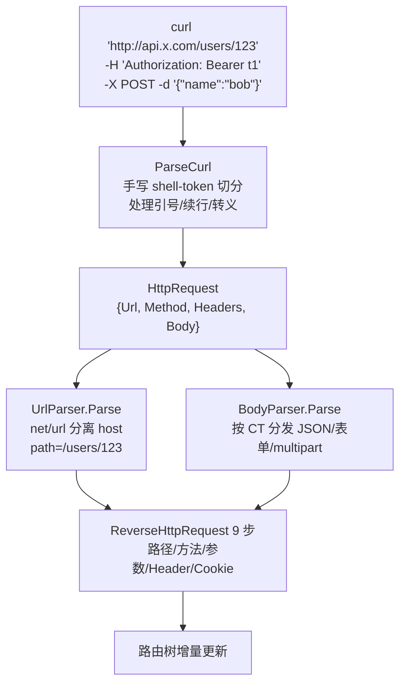
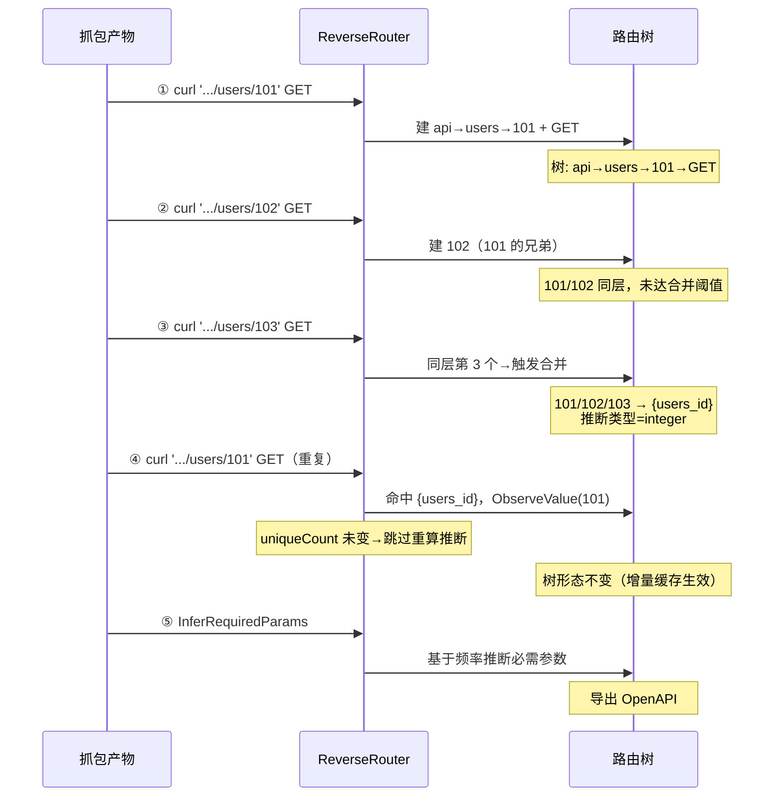
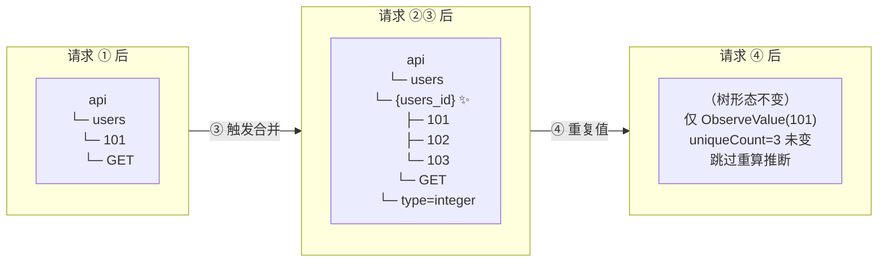
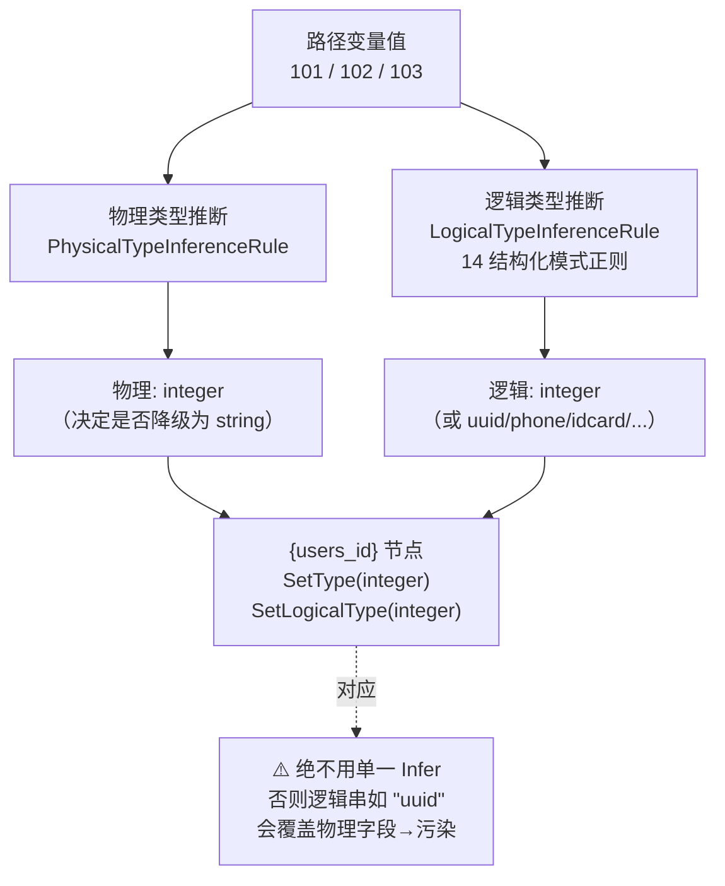
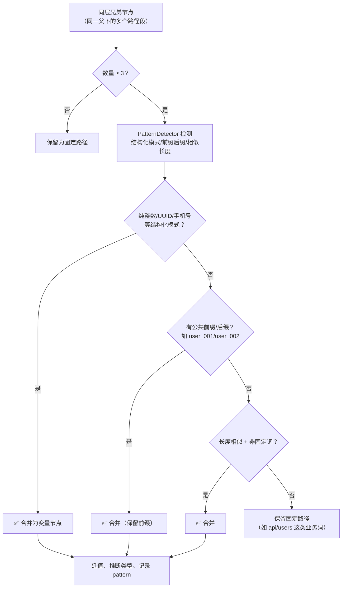

# 从抓包到路由树：算法到底如何还原

> 这一页用一组真实的 curl 抓包，配合多张 mermaid 图，把"流量如何逆向成路由树"讲到底。
>
> 配合阅读：[9 步逆向流程](/features/reverse-flow)（逐步技术细节） · [分层与数据流](/architecture/data-flow)（架构视角） · [一个完整示例](/guide/full-example)（可运行代码）。

## 场景：网络空间测绘的抓包产物

在测绘场景下，一次扫描会留下一批 curl 命令（来自浏览器 DevTools 的 "Copy as cURL" 或抓包工具导出）。算法的输入就是这一批 curl，输出是一棵路由树 + OpenAPI 规范。

::: tip curl 现在是一等公民
2026-07-17 起，`pkg/request/curl_parser.go` 的 `ParseCurl(curl string)` 可直接把一条 curl 命令解析成 `HttpRequest`，无需手写 URL/Header/Body。详见 [请求层 · CurlParser](/architecture/data-flow#_2-request-请求层)。
:::

## 第一张图：单条 curl 如何被拆解

一条 curl 进入后，先被解析成结构化请求，再喂给 9 步主流程。这条链路是这样的：

注意三个细节：
- **host 不进树**：`http://api.x.com/users/123` 经 `net/url` 解析后，路径只是 `/users/123`，host 是元数据不是路径段。
- **curl 的引号/续行被精确处理**：`-H 'Authorization: Bearer t1'` 里的引号被剥掉，header 值是 `Bearer t1`；反斜杠续行（`\<换行>`）被当作续行而非字面字符。
- **`-d` 隐含 POST**：有 `-d` 但没显式 `-X` 时方法默认 POST，且无 Content-Type 时默认 `application/x-www-form-urlencoded`。

## 第二张图：一批抓包如何逐条长出树

真实场景是**多条 curl 逐条喂入**，树逐步演化。下面用一个 4 条 curl 的最小抓包集，看树是怎么"长"出来的：

图里有两个关键算法行为，是"到底如何还原"的核心：

### 关键行为一：延迟合并

合并不是请求一到就触发，而是**同层兄弟达到阈值（默认 3）才合并**。所以：
- 请求 ①② 后树里还是 `101`、`102` 两个固定路径节点。
- 请求 ③ 后，`checkAndMergeSiblings` 发现 `users` 下有 3 个纯数字兄弟 → 判定它们是同一个路径变量 → 删掉 3 个固定节点，建一个 `{users_id}` 变量节点，把 3 个值迁过去。

> 为什么阈值是 3 而不是 2？两兄弟可能是巧合（两个特例），三兄弟才足以构成"这层是变量"的统计证据。详见 [选择性合并策略](/features/selective-merge)。

### 关键行为二：增量类型推断缓存

请求 ④ 是重复值 `101`。优化前，每次命中变量节点都会对**全部累积值**（101/102/103）重新跑 14 个正则匹配——这是 O(N²)，累积值上千时单个请求就要 600μs。

优化后（2026-07-17），节点记住了"上次推断时的 unique 值数"。请求 ④ 喂入重复值 `101`，unique 值数仍是 3，**与缓存相同 → 跳过重算**。只有喂入一个**全新**的值（如 `104`，uniqueCount 3→4）才会重新推断一次。

这就是为什么真实流量（ID 大量重复）能跑到**单核 ~78万 URL/秒**——绝大多数请求命中快路径。

## 第三张图：树的形态演化

用"树形 ASCII + 状态标注"直观展示上图的 4 个阶段树形态：

✨ 标记的是**合并触发点**——这是整个算法最具价值的瞬间：把 3 个看似无关的固定路径，识别为同一个变量。

## 第四张图：类型推断的两层结构

合并出变量节点后，要给它打上类型标签。算法分两层独立推断，**绝不混用**：

两层各管一件事：
- **物理类型**回答"这个值在内存/存储层是什么"——integer 还是 string。这里有个**长数字降级**机制：纯数字超过 15 位（如 18 位身份证号）会被降级为 string，因为超过 int64 范围，存储按数字会溢出。详见 [长数字串降级](/features/long-number)。
- **逻辑类型**回答"这个值在语义层是什么"——是 integer、uuid、手机号、身份证、银行卡……这里有 14 个正则模式 + `net.ParseIP` 兜底 IPv6。

历史上出过一个 bug：用单一 `Infer` 把逻辑串直接赋给物理字段，导致 uuid 的物理类型变成字符串 `"uuid"`。修复后严格走 `InferPhysicalAndLogical` 分别回填——这条约束写进了 [路径变量类型污染修复](https://github.com/cyberspacesec/reverse-router-tree-skills) 的记忆。

## 第五张图：合并的完整决策流

"到底怎么判断两个兄弟该不该合并"是算法最难的部分。不是"同层就合并"，而是多重启发式投票：

核心思想：**合并要有证据**。纯巧合的两兄弟不合并，必须是"这层有变量的统计/结构证据"才合并。这避免了把 `/api/users` 和 `/api/posts` 这种业务固定词误合并成变量。

合并的 4 种触发模式，每种对应一篇详解：
- [路径变量识别](/features/path-variable)（结构化模式）
- [前缀/后缀合并](/features/prefix-suffix-merge)（`user_001/user_002`）
- [相似串合并突破](/features/similar-strings)（长度相似）
- [选择性合并策略](/features/selective-merge)（总体决策框架）

## 性能：为什么能每秒几十万条

算法的两个 O(N²) 瓶颈在 2026-07-17 被消除：

| 优化点 | 优化前 | 优化后 | 效果 |
|--------|--------|--------|------|
| `stripPhoneSeparators` 分配 | 逐字符 Builder | 纯数字值零分配快路径 | Merge 1634→17 allocs/op |
| 类型推断全量重算 | 每命中对全部累积值重算 | uniqueCount 变化才重算（增量缓存） | 630μs→1.5μs/op（413x） |

单核基准（AMD Ryzen 9 5950X）：
- 纯路径命中（真实流量，ID 有重复）：**~78万 URL/秒**
- curl 解析：~52万 curl/秒
- curl 解析 + 路由还原全链路：~30万 curl/秒

远超"每秒几十万条 URL/cURL"的产品目标。详见 [吞吐量基线](https://github.com/cyberspacesec/reverse-router-tree-skills/blob/main/docs/02-current-status.md#吞吐量基线2026-07-17)。

> **已知约束**：并发合并受 `mergeMu` 串行临界区限制（合并多步非原子需串行化）。但合并低频（每 N 请求触发一次），单核已足够快，串行化代价可接受。

## 下一步

- 想**运行**这套流程 → [一个完整示例](/guide/full-example)（可复制的 Go 代码）
- 想**逐步**看 9 步技术细节 → [9 步逆向流程](/features/reverse-flow)
- 想**导出**成 OpenAPI → [OpenAPI 导出](/features/openapi-export)
