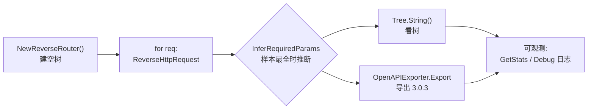

# 快速上手

## 环境要求

- Go ≥ 1.23
- 模块名：`github.com/cyberspacesec/reverse-router-tree-skills`

## 最小例子

下面这段代码：喂 3 个请求进去 → 打印还原出的路由树 → 导出 OpenAPI。



```go
package main

import (
	"fmt"

	"github.com/cyberspacesec/reverse-router-tree-skills/pkg/exporter"
	"github.com/cyberspacesec/reverse-router-tree-skills/pkg/request"
	"github.com/cyberspacesec/reverse-router-tree-skills/pkg/router"
)

func main() {
	r := router.NewReverseRouter()

	// 3 个看起来不同、其实是同一接口的请求
	reqs := []*request.HttpRequest{
		request.NewHttpRequest("/api/users/123?page=1", nil, "GET", nil),
		request.NewHttpRequest("/api/users/456?page=2", nil, "GET", nil),
		request.NewHttpRequest("/api/users/789?page=3", nil, "GET", nil),
	}

	for _, req := range reqs {
		_ = r.ReverseHttpRequest(req) // 逆向进树
	}

	// 1. 看还原出的路由树
	fmt.Println(r.Tree.String())

	// 2. 导出为 OpenAPI 3.0.3
	e := exporter.NewOpenAPIExporter()
	e.Title = "Demo API"
	out, _ := e.Export(r.Tree)
	fmt.Println(string(out))
}
```

输出（路由树部分）会是这样：

```
root
└── api [Path]
    └── users [Path]
        └── {users_id} [Var, integer]
            └── GET [Method]
                └── page [Param]
```

`/api/users/123` 被识别成变量 `{users_id}`（物理类型 `integer`），`page` 被识别成查询参数并推断出 `integer` 类型。导出的 OpenAPI 里 `{users_id}` 自动标为 `required: true`（路径变量必填），`page` 标为 query 参数。

## 关键 API 速查

源码：[`NewReverseRouter` (reverse_router.go:60-71)](https://github.com/cyberspacesec/reverse-router-tree-skills/blob/main/pkg/router/reverse_router.go#L60-L71) · [`ReverseHttpRequest` (reverse_router.go:143-256)](https://github.com/cyberspacesec/reverse-router-tree-skills/blob/main/pkg/router/reverse_router.go#L143-L256) · [`IsNeedRequest` (reverse_router.go:890-990)](https://github.com/cyberspacesec/reverse-router-tree-skills/blob/main/pkg/router/reverse_router.go#L890-L990) · [`InferRequiredParams` (reverse_router.go:841-874)](https://github.com/cyberspacesec/reverse-router-tree-skills/blob/main/pkg/router/reverse_router.go#L841-L874) · [`Tree`](https://github.com/cyberspacesec/reverse-router-tree-skills/blob/main/pkg/tree/tree.go) · [`OpenAPIExporter`](https://github.com/cyberspacesec/reverse-router-tree-skills/blob/main/pkg/exporter/openapi.go)

```go
r := router.NewReverseRouter()          // 创建逆向路由器（自带一棵空树）

// 核心：把一个请求逆向进树
r.ReverseHttpRequest(req)               // 返回 error

// 去重判断：这个请求还需要发吗？
r.IsNeedRequest(req)                    // 返回 bool

// 必需参数推断（建议导出前调一次）
r.InferRequiredParams()                 // 返回推断出的必需参数数

// 路由树输出
r.Tree.String()                         // 树形文本
r.Tree.ToJSON()                         // JSON（含类型信息，可往返反序列化）

// OpenAPI 导出
exporter.NewOpenAPIExporter().Export(r.Tree)  // []byte, OpenAPI 3.0.3

// 可观测性
r.SetLogLevel(router.LogLevelDebug)     // 打开调试日志看全链路决策
stats := r.GetStats()                   // 11 项统计指标快照
r.ResetStats()                          // 清零
```

## 配置合并阈值

默认配置是经验调优过的，但你可以改：

```go
r := router.NewReverseRouter()
r.SetMergeConfig(router.MergeConfig{
	SiblingMergeThreshold:       3,   // 同层 ≥3 个兄弟才尝试合并
	PatternSimilarityThreshold:  0.6, // 模式匹配率 ≥0.6 才合并
	SimilarLengthBreakThreshold: 6,   // 6+ 个相似串才突破合并
	RequiredParamThreshold:      0.9, // 出现率 ≥0.9 判定必需
})
```

## 下一步

- 看这个例子的完整展开 → [一个完整示例](./full-example)
- 理解 9 步流程怎么跑的 → [9 步逆向流程](/features/reverse-flow)
