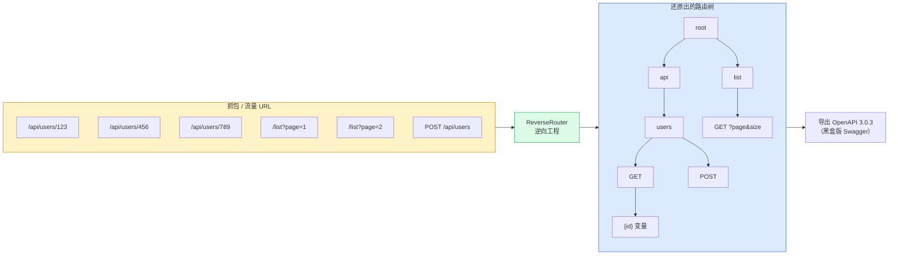

# 这是什么

> 一句话：**给你一堆抓到的 URL，还你一棵还原好的路由树。**


## 问题背景

在网络空间测绘（Cyberspace Mapping）中，你会从抓包 / 流量里收集到大量 URL：

```
/api/users/123
/api/users/456
/api/users/789
/list?page=1&size=10
/list?page=2&size=20
POST /api/users  (Content-Type: application/json)
GET  /api/data   (Accept: application/json)
GET  /api/data   (Accept: text/html)
```

这些是**同一个个接口的不同实例**，但它们长得不一样。爬虫会把它们当成 8 个不同的 URL 去请求 8 次，安全扫描器会重复测试同一个接口 8 次。

真正的问题是：**怎么把这些散落的 URL 还原成目标服务器真实的路由结构？**

```
/api/users/{id}          ← 123/456/789 是同一个变量
/list?page&size          ← page/size 值不同但参数模式固定
POST /api/users          ← 一个独立接口
GET  /api/data           ← 按 Accept 分流的接口
```

还原出这棵树，你就拿到了一个“黑盒版的 Swagger”。

## 它做的事



输入是大量 HTTP 请求，输出是一棵像 Spring 路由映射表一样的树，同时：

- 识别路径变量（`/api/users/123` → `/api/users/{id}`）
- 识别查询参数模式（`page` 是 integer、必需；`size` 可选）
- 识别 Content-Type / Header / Cookie 路由维度
- 推断参数的物理类型与逻辑类型
- 导出为 OpenAPI 3.0.3

## 与现有方案的区别

| 方案 | 是否需要目标配合 | 能否还原变量 | 适合场景 |
|------|------------------|--------------|----------|
| **白盒（Swagger/OpenAPI 文档）** | 需要，目标主动暴露 | 文档里已标注 | 目标友好、有文档 |
| **传统黑盒爬虫** | 不需要 | ❌ 只收集、不去重 | 广度优先收集 |
| **本项目（逆向路由树）** | 不需要 | ✅ 自动推断 | 黑盒安全测试、测绘 |

核心差异：**纯黑盒 + 还原结构 + 类型推断**。爬虫只“存”，本项目“理解”。

## 这是一个教学项目

本站点本质是教学站。看完你应该能回答：

1. 项目解决了什么问题、解决得怎么样
2. 路由树是怎么一步步从请求长出来的（[9 步流程](/features/reverse-flow)）
3. `/api/users/123` 凭什么被识别成变量（[路径变量识别](/features/path-variable)）
4. 为什么 `list`/`create` 不会被误合并（[选择性合并](/features/selective-merge)）
5. 手机号、身份证号是怎么认出来的（[中国特有格式](/features/china-formats)）
6. 最终怎么导出成 OpenAPI（[OpenAPI 导出](/features/openapi-export)）

每个功能点都配了图示 —— 一图抵千言。

## 下一步

- 想知道这件事为什么值得做 → [为什么重要](./why-important)
- 想看完整能力清单 → [它能做什么](./capabilities)
- 想直接跑起来 → [快速上手](./quick-start)
- 想看一个端到端例子 → [一个完整示例](./full-example)
