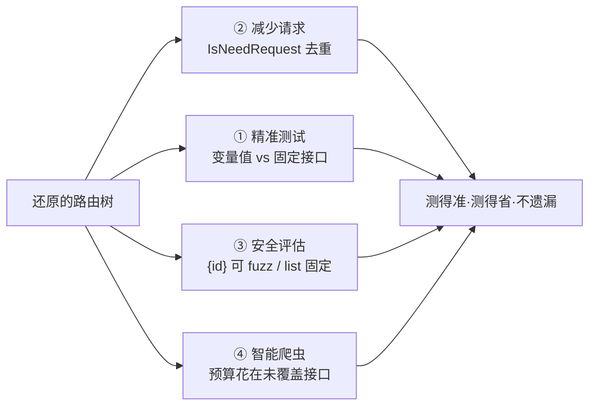

# 为什么重要

还原路由结构不是炫技，它直接决定了黑盒测试与测绘的**质量**和**成本**。

## 没有它会怎样

假设你抓到 1000 个 URL，其中 300 个其实是同一个接口的路径变量：

```
/api/orders/1001   ┐
/api/orders/1002   │  实际是同一个接口 /api/orders/{id}
/api/orders/1003   │  但爬虫看到的是 300 个不同 URL
...                │
/api/orders/1300   ┘
```

**不还原结构 = 把同一个接口当 300 个测。** 后果：

| 后果 | 说明 |
|------|------|
| ❌ 重复请求 | 300 次请求浪费在同一个接口上 |
| ❌ 测试资源浪费 | 扫描器配额、QPS、时间被无意义消耗 |
| ❌ 攻击面失真 | 以为有 1000 个接口，实际只有 700 个，无法判断真实规模 |
| ❌ 遗漏变量值 | 不知道哪些值该继续 fuzz、哪些已覆盖 |

## 还原后会怎样

```
   1000 个原始 URL                    还原后路由树
┌─────────────────────┐           ┌──────────────────────┐
│ /api/orders/1001    │           │  └─ orders           │
│ /api/orders/1002    │ ────────▶ │     └─ GET           │
│ ...×300            │  合并变量   │        └─ {id} ✨    │  ← 1 个接口
│ /api/orders/1300    │           │  └─ products         │
│ /api/products/...   │           │     └─ ...           │
└─────────────────────┘           └──────────────────────┘
   1000 条 → 测 1000 次             700 个真实接口 → 测 700 次
```

**还原结构 = 测得准、测得省、不遗漏。**

## 四个核心价值



### 1. 更精准的接口测试

知道哪些是真正的接口、哪些只是变量值变化，避免把 `/api/users/123` 和 `/api/users/456` 当两个接口各测一遍。

### 2. 减少重复请求

同一接口不反复请求。`IsNeedRequest()` 会直接告诉你“这个 URL 已经覆盖过了，不用再请求”——爬虫和扫描器据此省下大量请求。详见 [IsNeedRequest 去重](/features/is-need-request)。

### 3. 更好的安全评估

完整还原攻击面。变量节点 `{id}` 提示你：**这里有一个可枚举的 ID 参数值得继续 fuzz**；固定路径 `list` 提示你这是固定功能不需要枚举。攻击面从“一坨 URL”变成“一棵语义清晰的路由树”。

### 4. 智能爬虫

爬虫知道哪些 URL 还需要请求（新路径 / 新参数 / 新 Header 值），哪些已经覆盖过，从而把有限的爬取预算花在真正未覆盖的接口上。

## 用一张图概括

```
              ┌──────────────────────────────────────┐
              │         抓包 / 流量 URL 池            │
              └──────────────────┬───────────────────┘
                                 │
                          逆向路由树
                                 │
              ┌──────────────────▼───────────────────┐
              │            还原的路由树                │
              │   (路径变量 / 参数 / 类型已标注)        │
              └────┬────────────┬───────────┬─────────┘
                   │            │           │
            ┌──────▼──┐   ┌─────▼────┐ ┌────▼─────┐
                精准        去重         智能爬虫
                测试        节省         知道该爬哪
```

## 下一步

- 看完整能力清单 → [它能做什么](./capabilities)
- 直接上手 → [快速上手](./quick-start)
